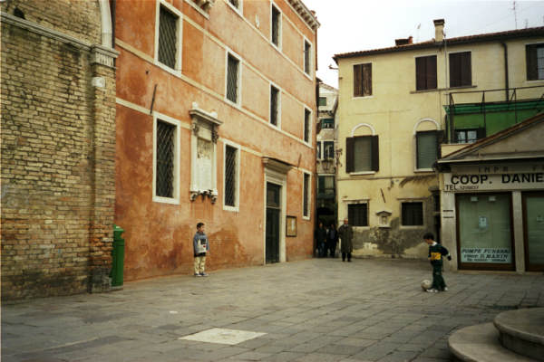
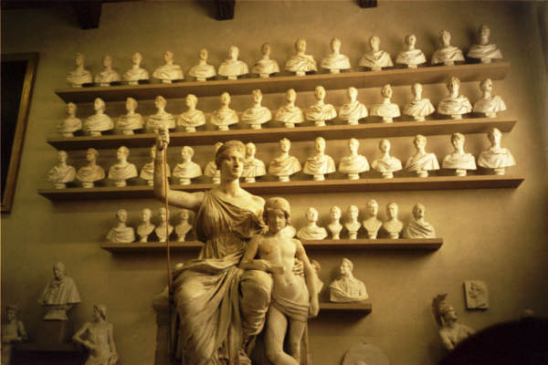
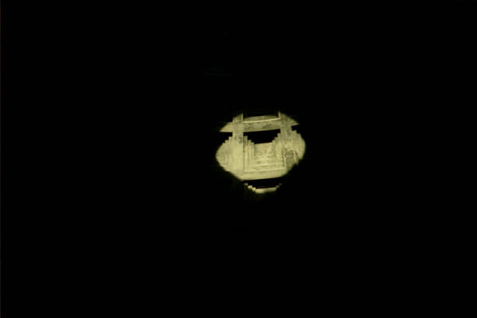
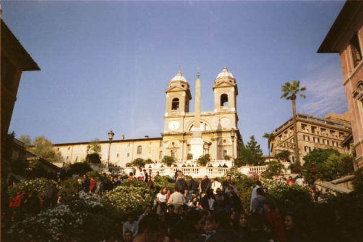
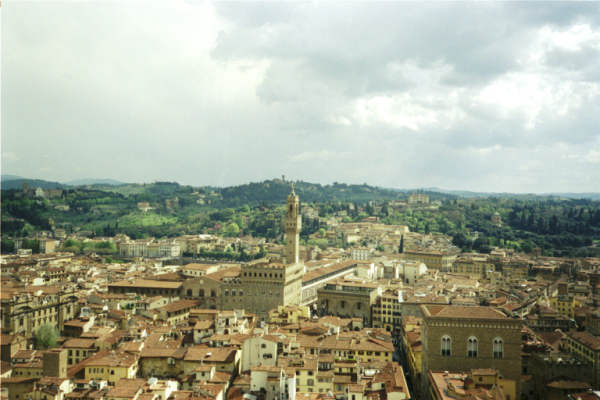
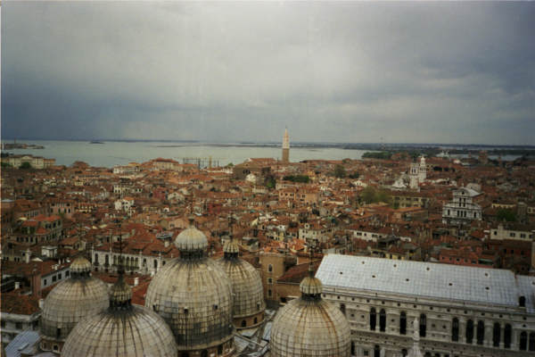
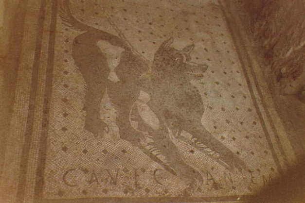
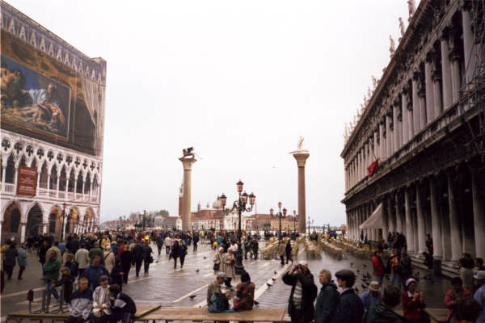
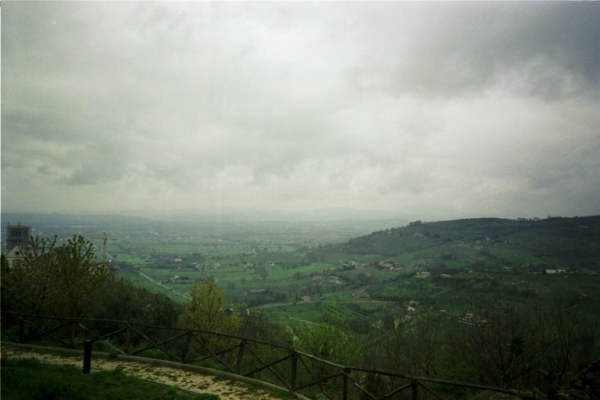

This week is my last week as a software developer at Education First. I’m off to something new, but before going I wanted to take a look back at my first EF trip. I went on two trips while working at EF (Spain first, then [Ireland and the United Kingdom](https://www.builtwith.coffee/posts/2019/april/capitals-of-the-british-isles/)), but my very first one was as a customer, back in high school, when my Latin class went to Italy on a tour now called [Bell’Italia](https://www.eftours.com/educational-tour/beautiful-italy).

When I went looking for some sort of evidence of that trip to Italy, I realized all of the pictures I took had never made it to any form of modern computing storage — they were still saved on some floppy disks back at my parent’s house. The timing was fortunate though, my parents were coming up for Thanksgiving anyway, all I needed to do was order a USB disk reader off of Amazon.

**Technical aside:** The floppy disks are from Mystic Color Lab, where we got all of our film processed, circa 1999 (take that, Y2K!). The pictures were processed then scanned, and saved at a _mind-blowing_ 600×400 resolution. If I remember correctly that was close to what you got from a low end digital camera at the time, and it probably gave them some overhead to always fit 1 roll of film on 1 floppy disk. I think our computer at the time had a 800x600 display so I’m sure they looked great on it. Impressively, all of the 20 year old disks could be read without issue, but sadly no one seems to know where the printed copies of these photos are, so 600×400 might be the best I’m ever going to have of these. Also worth mentioning, two years later I had a digital camera that took pictures at 1280×960 and Mystic Color Lab was out of business.

Of course I’m not in any of these pictures, so there’s no proof that I really went except for me having these random pictures of Italy, but I assure you I did. It was maybe the most memorable experience from high school, even before finding these photos I knew what was on all of them, and it was one of the primary motivations for wanting to work at EF. I’m sad to go, but I’m excited about what’s next, and I’m betting that they’ll pop back up in my life when my daughter is old enough to travel.

_kids playing soccer in an alley in Venice, which is peak Italy as I remember it_

_Michelangelo’s workshop in Florence_

_light from the center hole in the Pantheon_

_Spanish Steps in Rome_

_Florence from the Duomo_

_Venice from St. Mark’s campanile_

_the picture every Latin student has to take, from Pompeii_

_St. Mark’s square_

_the countryside around, if I remember correctly, Assisi_

