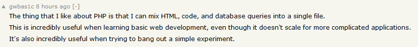

Found on a [Hacker News thread about PHP in 2019](https://news.ycombinator.com/item?id=19917655).

I don't write any PHP these days, but the sentiment of a single file that combines HTML, JavaScript, and database queries to quickly knock out simple projects resonates - that's the exact setup I have for the [Gatsby](https://www.gatsbyjs.org/) powered files that generate this site. There's no `<?`s any more though, it's GraphQL queries and JSX that covers both the JS and the HTML.

I can't see ever going back to PHP - I'd prefer Python and I know more C# than it at this point - but I'll never complain about it being a quick and (sometimes) dirty language.
