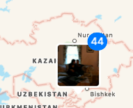

This was a [great bug](https://arstechnica.com/gadgets/2008/07/careful-with-that-iphone-or-you-might-end-up-in-kazakhstan/) from my iPhone 3G that just keeps on giving every time I open Photos.

We were joking at work the other day about how dealing with timezones will only be worse once space travel is common, but imagine getting someone results for the closest pizza place on the wrong planet. Also, I couldn't find what you call geotagging on Mars (maybe still geotagging since geo usually relates to lower-case earth not Earth), but fortunately there's [a microformat spec proposal](http://microformats.org/wiki/geo-extension-strawman) for it already.
