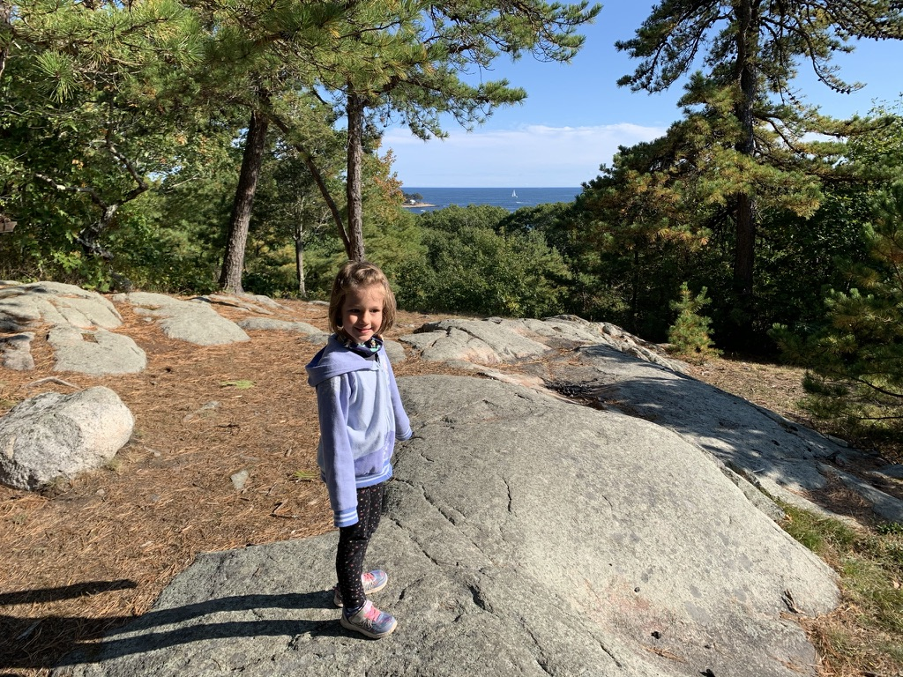
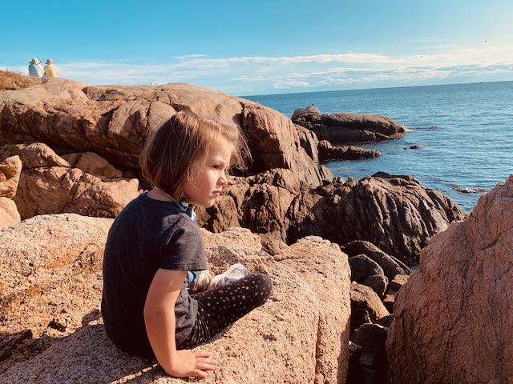

The kiddo and I set out for a hike yesterday. We planned on going to [Ravenswood Park](https://thetrustees.org/place/ravenswood-park/), but when we got there the parking lot was full. A sign outside said “if the lot is full, come back some other time”. On the way we had passed another parking lot in the woods with a sign that I didn’t get a chance to read as we drove by, but I figured, “it’s a trail, it’ll get us in the woods either way”.

So we drove down the road and pulled in. The parking lot sign read [Coolidge Reservation](https://thetrustees.org/place/coolidge-reservation/). We found a trailhead and walked in, but picked the one that didn’t have a map, so I looked one up on my phone. Seemed like the trails were short and the other end was a big field by the ocean. Ended up being just the right amount of hiking for a 5 year old, about 2 miles with a little hill that looked out over the ocean, a huge field to run through, and nice rocky Atlantic Ocean cliffs.

_Bungalow Hill, towering a whole 110 feet over the ocean below_

_this slightly angry face was brought about by me insisting she could not climb down the rocks to get closer to the water_
