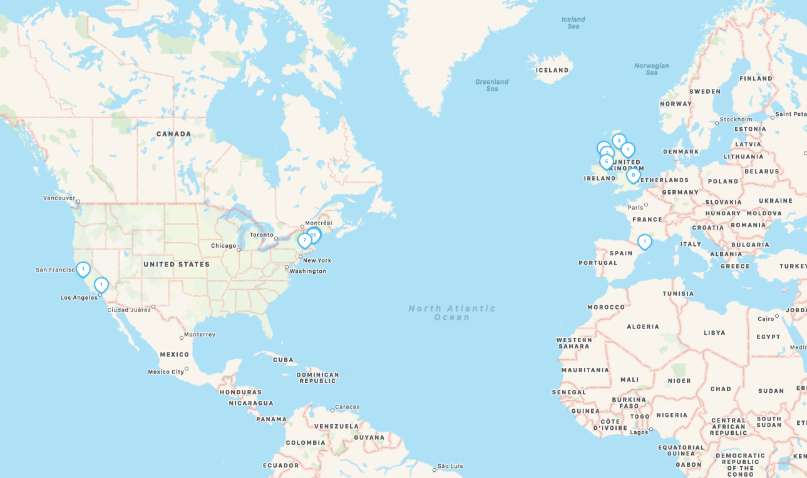

I've gone back and forth on where to journal things for a while, but I've been using the MacOS/iOS/iPadOS/WatchOS app [Day One](https://dayoneapp.com) for two years now. And I know it's been two years, because Day One has a feature where it shows you what happened “on this day” in previous years, and yesterday was the first day it had an entry from two years ago. And no, the entry wasn't “the end of 2020 is going to be terrible!”, it was about a job interview, which became theme in 2019.

I'm not going to say Day One is the perfect app, and I generally don't like apps with recurring fees, but it does a few things really well:

- You can see your posts on a map. If you usually write on your phone, or take pictures on your phone, it will infer the coordinates from that. You can then search for posts by location, or just zoom around all the places you've been.

- You can record sound from your Apple Watch. Sometimes if I'm just out in the woods/by the beach/listening to my kid sing a made up song, I'll turn it on.
- The aforementioned “on this day”, which has been wild in 2020, looking back at times when we did exotic things like “travel” and “see family members”.
- You can split the journals up by theme, but also view them all in aggregate, so I have one that’s just for food, one for rides/hikes.
- You can turn on end to end encryption on everything.

It has some silly features, like prompts. Some are interesting, others are like this:

I’ve never considered [printing it](https://help.dayoneapp.com/en/articles/769055-book-printing), a service they offer. I back it up, you can export the whole thing to HTML. Should I print it? Maybe. I’ll make a note today and see how I feel in two years.
