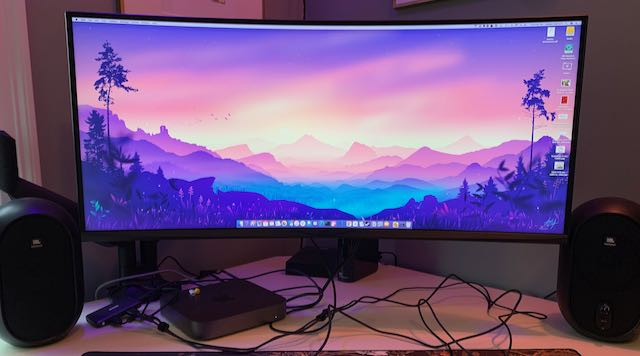

_please ignore the messy cables_

I picked up a (deep inhale) [Monoprice 35in Zero-G Curved Ultra-Wide Gaming Monitor](https://www.monoprice.com/product?p_id=38035) during the CyberblackFriMonTurkeyWeek sales. I’d been debating a new monitor for... a long time. I had a 24ʺ Dell 16:10 WUXGA monitor that was “good enough” — I had 27ʺ QHD monitors at work but they didn’t feel noticeably better, and I didn’t like the idea of scaling (or paying for) a 4k monitor.

At 3440x1440, this monitor is ~1.7 times wider and a bit taller with no bezels in between. Feels like a good compromise. As someone who works in a code editor with 5 primary colors the colors are fine, and the viewing angles are good enough for the curve, assuming you don’t try to hang from the ceiling to look at it, or peek from another room. I set it up using the [calibration guidelines from this Tom’s Hardware article](https://www.tomshardware.com/reviews/monoprice-zero-g-35-inch) and then ran through the [MacOS expert display calibration](https://osxdaily.com/2015/10/14/access-expert-mode-screen-color-calibrator-mac-os-x/) to make a color profile that [you can download here](/assets/files/V3L6W_Expert_Calibrated.icc).
