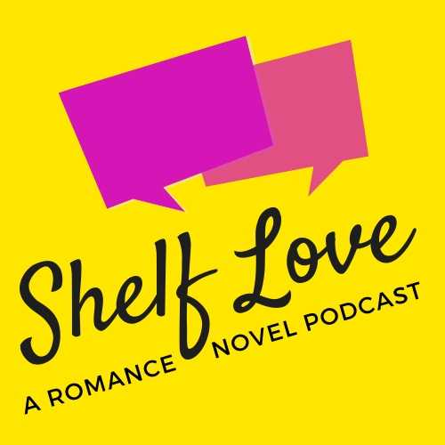

Late last year my wife started a new podcast called [Shelf Love](https://podcasts.apple.com/us/podcast/shelf-love-a-romance-novel-book-club/id1480593827).

I built her a website. It was not good. It worked, but brought us both great shame.

To be fair, at the time there wasn’t a lot of content, and most of what she needed/wanted from it was theoretical. But, time has passed, and now there’s 38 episodes with many more to come, a blog, and a newsletter.

Beyond a visual refresh, the back-end of the site was changed from pulling episode content from [Storyblok](https://www.storyblok.com) to pulling it directly from [Simplecast](https://simplecast.com) which means content isn’t living in two places. Storyblok is still in play for page content and blog posts. It’s also still a [GatsbyJS](https://www.gatsbyjs.org) site distributed through [Netlify](https://www.netlify.com).

Anywho, [go check it out](https://shelflovepodcast.com).

