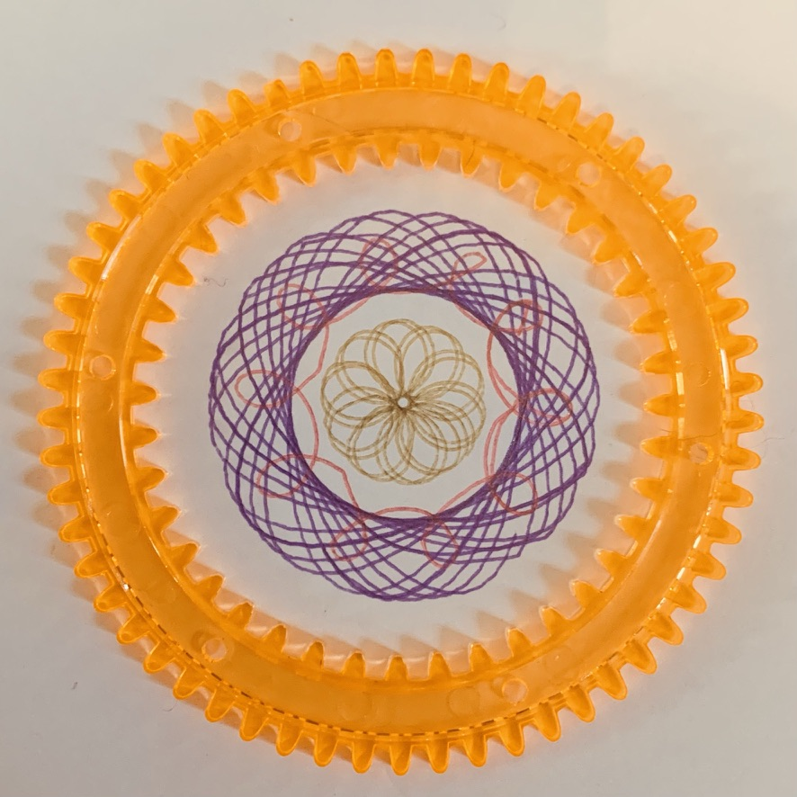

We were cleaning out toys this weekend and found a gear drawing set for making spirographs. A family member bought it for my daughter to take on a flight when she was younger, but she was _too_ young to enjoy it at the time. We had more fun with it this week, and finally got around to using [these Zebra pens](https://www.zebrapen.com/product/sarasa-clip-gel-retractable/?source=brand) I had.

But, the programmer in me said, “hey, sometimes the gear skips, what if we did it in code”, and made this.

<iframe height="486" style="width: 100%;" scrolling="no" title="JS Spirographs" src="https://codepen.io/jjmartucci/embed/RwRqqmP?height=486&theme-id=light&default-tab=result" frameborder="no" loading="lazy" allowtransparency="true" allowfullscreen="true">
  See the Pen <a href='https://codepen.io/jjmartucci/pen/RwRqqmP'>JS Spirographs</a> by Joseph Martucci
  (<a href='https://codepen.io/jjmartucci'>@jjmartucci</a>) on <a href='https://codepen.io'>CodePen</a>.
</iframe>

The colors are random, have fun reloading / changing the variables.

Obligatory Simpsons gif:

