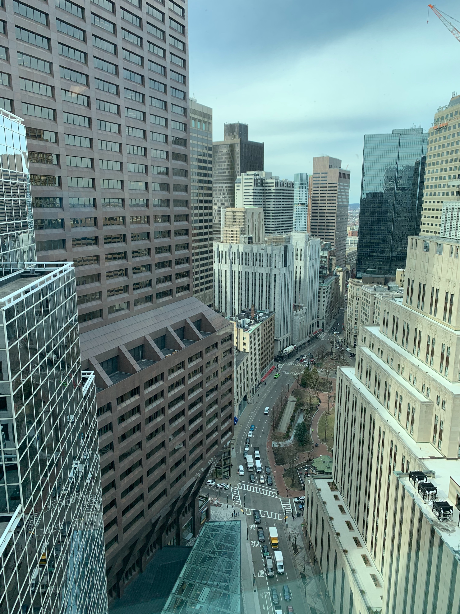

A year ago was my last day in the office. It was also my first day in that particular office — we were moving out of a WeWork into a new space and I needed to get my stuff out before everything shut down.

The new place had (has?) a decent view. You can see from here that the city was already emptying out at this point.

I was also in the city because my parents were in town, and I met them for dinner. The restaurant only had us and one other table. The train I took home was almost empty.

I looked back at some notes from March of last year. I was very wrong about how long this would last, but almost everyone was. For a few days it seemed like maybe a planned April vacation was still on the table. Some notes that stood out:

> It’s the weekend, which I’m guessing is going to feel a lot like every other day of the week for a few weeks.

This was definitely true. During the Summer I was also at least partially expected to be available for work so it really never felt like there was a weekend. The situation is better now: with my daughter having classes the weekends mean something to her again, and I occasionally flip the whole concept and do something like make pancakes for breakfast on a Tuesday. It’s not like anyone is rushing around in the morning, so why not.

> Talked to my mom, they seem ok. She said there’s a 30 day ban on all visitors to nursing homes, which she’s pretty upset about. I think worst worst worst case something happens to my Grandmother now and there’s no funeral.

This one came partially true, unfortunately. We did have a funeral, it was a beautiful day in June so we could have it outside, but only five of us could attend. It was also the last time I’d see my parents in 2020, although they’re now half vaccinated, so hopefully that streak will be over soon.

The 30 day ban was, in hindsight, closing the gate after the horse had bolted. After 98 years of living that's a shit way to go, but we are certainly not the only family in the country with this same story.

> We made cookies and Lorelei filled up a notebook I’m already running out of ideas.

This was the third day in. I came up with lots more ideas, luckily.

> I’m tired of this shit.

32 days in.

Things, honestly, got better. You say “wow, we’re actually pretty fortunate” enough times and it starts to stick in your brain. Some highlights I found:

* We went to two zoos we’d never been to before, once for animals, once for Christmas lights.
* I made the local news when I, unintentionally, was one of the first people back in a dentist’s office for a regular cleaning.
* Went to a [bunch of parks](https://www.builtwith.coffee/blog-posts/2020/10/coolidge-reservation) I hadn’t been to before, including [some by the ocean](https://www.builtwith.coffee/blog-posts/2020/12/waikiki).
* [Fixed up an old guitar](https://www.builtwith.coffee/blog-posts/2020/08/the-20-year-history-of-a-partscaster).
* [Made a website for my wife’s podcast](https://www.builtwith.coffee/blog-posts/2020/05/shelf-love-podcast).
* [Played](https://www.builtwith.coffee/blog-posts/2020/11/testing-some-things-might-delete-later) with [toys](https://www.builtwith.coffee/blog-posts/2020/12/instax).
* [Made the home office nicer](https://www.builtwith.coffee/blog-posts/2020/12/monoprice-35-ultrawide).
* [Beat a lot of video games](https://www.builtwith.coffee/blog-posts/2020/11/game-of-the-year).
* … and had plenty of time to do little things. Today was a beautiful day, and I thought we should go outside, so I found a pair of socks for my daughter, then went and put one sock each on each of our sleeping cat’s heads, and told her I had an adventure ahead of her to go find them.