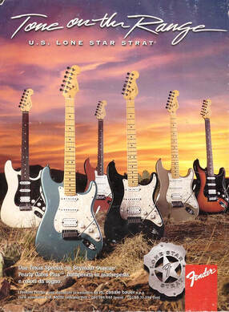
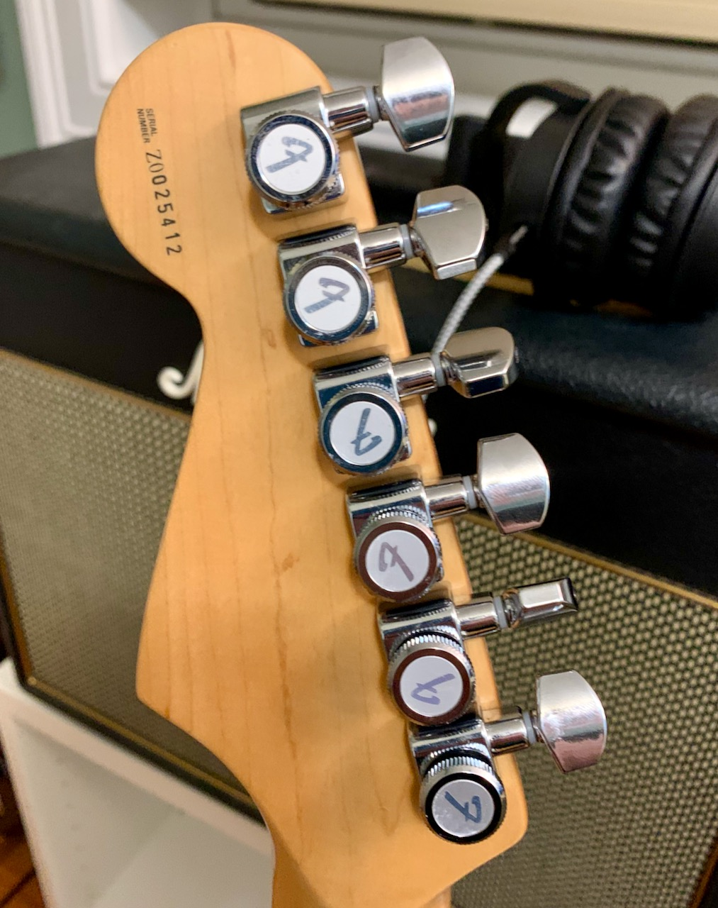

After [fixing up my old Squier Stratocaster](https://www.builtwith.coffee/blog-posts/2020/08/the-20-year-history-of-a-partscaster) last Summer, it became my go to guitar when I sat down to play over my _other_ Strat, a 2000 Lone Star. I started to wonder why, since the Lone Star is (or should be) the nicer of the two. I sat down and looked it over and tried to figure out what was wrong, and this is what I came up with. Note that “at some point below” could have been any point in the last 20 years:
1. At some point I’d lost the spring in the tremolo, which caused it to either flop around or stay locked into position.
2. At some point I’d switched it to higher gauge strings, or messed with the action and it was annoyingly high.
3. At some point I’d wanted to have it push more from the guitar itself, the pickups were screwed up close to the strings.
4. It hadn’t been cleaned in a while, or lubricated. If you touched the tremolo the G-string would make sound like a train derailing. 

Aside: when I bought this guitar I was debating between it and an Ibanez Jem. Looking back at the advertising for it, I wonder what part of it I found appealing. 🤔

I pulled the strings, cleaned and lubricated everything, installed locking tuners and a spring for the tremolo, and dropped the pickups down to lower than they were when I got it. I don’t love the Texas Special pickup in the neck but I do oddly love it in the middle, and I’m too lazy to muck around with changing just the neck pickup out.

_Locking tuners. Why didn’t I do this years ago._

Of course, if you really want to test tuning stability, you give your guitar to your five year old and let her do her best Hendrix impersonation.

<iframe src="https://player.vimeo.com/video/544039533?badge=0&amp;autopause=0&amp;player_id=0&amp;app_id=58479" frameborder="0" allow="autoplay; fullscreen; picture-in-picture" allowfullscreen style="position:absolute;top:0;left:0;width:100%;height:100%;" title="IMG_4772.mov"></iframe>
