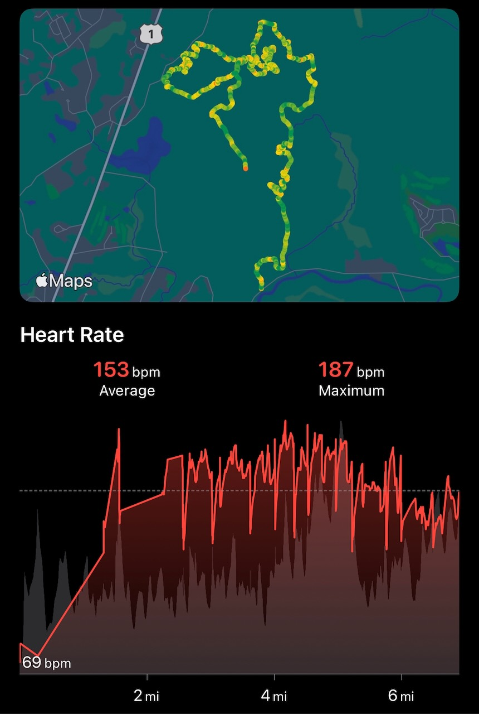

I was in the office two days this week. I took the train in both days, it was a ~50% as crowded as I remembered it from the pre-pandemic times. It was comfortably crowded, if you can call it that.

I missed the city. It’s not like we live in the farmlands but both days I walked from North Station to just past South, through the heart of downtown Boston, past historical landmarks from the early days of America and skyscrapers not yet a decade old. It is also mind-blowing to take that particular walk, because while I’m not native to Massachusetts I’ve lived here long enough to remember when it was just the noise and exhaust from 93 overhead.

Also I finally got a cup of coffee from [George Howell](https://www.georgehowellcoffee.com) at [Boston Public Market](https://bostonpublicmarket.org). I like our local place more but it was good and I’m very glad for whoever thought to build the Boston Public Market.

### Pfots
Got my third Pfizer shot this week. That’s… as exciting as it was. Got a really great nap in later in the day.

### What are you watching, Apple Watch
I do like my Apple Watch but lately it’s been… finicky. This was from a bike ride today.

I made it almost two miles without increasing my heart rate at all, and then teleported almost two miles later.

### Christmas Prep

### etc
Reading from this week:
- Finished [The Song Of Achilles](https://www.indiebound.org/book/9780062060617). Circe was was [one of my favorite books of 2019](https://www.builtwith.coffee/blog-posts/2019/12/no-pizza-for-me), _The Song of Achilles_ will probably be one of my favorite of 2021.
- [The Internet Has a Rat Poison Problem](https://www.audubon.org/magazine/winter-2021/the-internet-has-rat-poison-problem). I think there’s a bigger issue about supply sourcing and the large e-commerce retailers but this one is pretty eye opening.
- [A Better Relationship with the Internet](https://hypertext.monster/2021/12/10/a-better-relationship.html)
- [America Is Running on Fumes](https://www.inkl.com/news/america-is-running-out-of-new-ideas?share=ylMMrGIVyyQ) via [Ran Prieur](http://ranprieur.com)