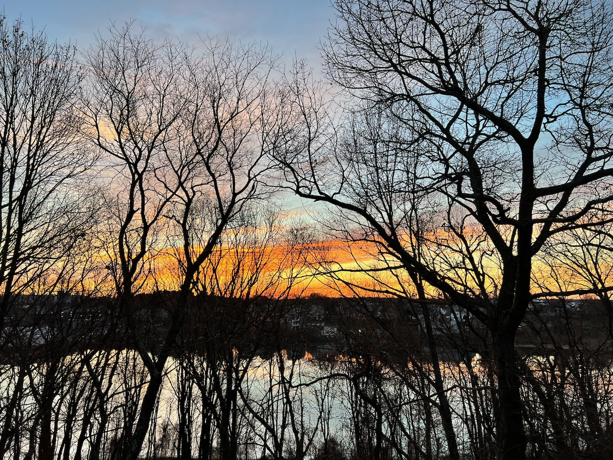
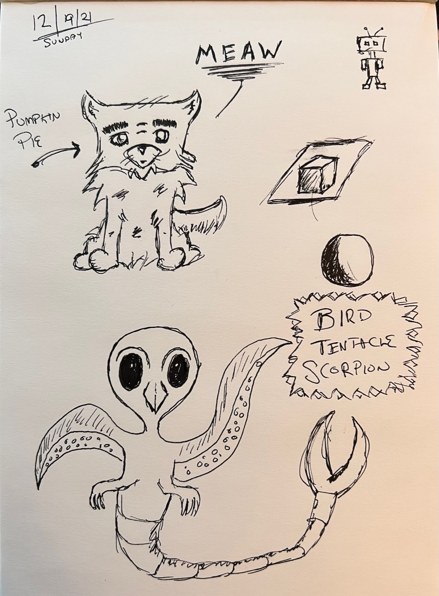

My father has a few rhymes that he breaks out whenever relevant, and one is a common weather forecasting one:

> Red sky at morning, sailors take warning.
> 
> Red sky at night, sailors' delight.

The sky was throwing some moods this week, but storms, at least for us landlubbers, didn’t develop in a meaningful way.

Monday:

Tuesday:

What I do love about that little rhyme though is that it’s thousands of years old, and it’s [accurate enough](https://www.loc.gov/everyday-mysteries/item/is-the-old-adage-red-sky-at-night-sailors-delight-red-sky-in-morning-sailors-warning-true-or-is-it-just-an-old-wives-tale/) that it’s been worth repeating all of those thousands of years.

### Seasonal wind-down

This has been an uneventful week. Ideally this next one is too, and the one after that… super uneventful. If humans could hibernate, I would. We’re also all trying to lay somewhat low, we are going to see my parents next week and I’d rather not deliver a package of germs for Christmas.

- Of tiny, murderous note, I did start playing [Death’s Door](https://www.playstation.com/en-us/games/deaths-door/). I heard a lot of favorable comparisons to Zelda — it’s not that, but once you get a few crow hops in, it’s a delight of its own.
- Also I introduced Lorelei to the idea of the doodle pad. Just a blank notebook you doodle in. Doodling seemed like a foreign concept to her, and honestly it’s been a while for me, as well. I explained it as just drawing shapes, and then seeing where you end up. I remember both my mother and her father having paper all over the house with doodles on it, opened envelopes, marginalia in catalogs, hotel sticky notepads. Just something to do while talking on the phone.

This is where we ended up:

- I almost bought an interesting book in Apple Books this morning, then stopped. I’ll get it from the local book store or library. I’ve been adamant about not reading digital books lately, and I’d like to stay that way. Also I have a Winter plan to build a little library[^1] for the yard for Spring, and it needs more souls.

### etc

- [Mess with DNS](https://messwithdns.net) via/made by [Julia Evans](https://jvns.ca/blog/2021/12/15/mess-with-dns/)
- [Why would a business push a native app over a website?](https://css-tricks.com/why-would-a-business-push-a-native-app-over-a-website/). Yes, why. I’m living this dilemma these days. One point Chris brings up that’s particularly painful to me is: “Because they get the full feature set of APIs”. Not only the full feature set, but you know which feature set they’re getting, instead of doing the which browser / which features hokey-pokey.
- ["It's a true frontier of game design": How Naughty Dog and Insomniac Games think about accessibility](https://www.eurogamer.net/articles/2021-12-18-its-a-true-frontier-of-game-design-how-naughty-dog-and-insomniac-games-think-about-accessibility), which led me to [Accessible Player Experiences (APX)](https://accessible.games/accessible-player-experiences/#access-patterns). If there’s a resource similar to this for the web, please let me know!
- [Play therapy prescribes video games to combat anxiety](https://www.rockpapershotgun.com/play-therapy-prescribes-video-games-to-combat-anxiety)
> However I recently read that Geek Therapy, a non-profit advocating the use of video games for wellness, promote using world-building games such as Minecraft, Roblox, Animal Crossing, and Fortnite to help people deal with mental health issues.

…creative Fortnite, I assume. The “rooty tooty let’s go shooty” version of Fornite _does not_ reduce anxiety, for me.
- [Debt Demands a Body](https://longreads.com/2021/12/01/debt-demands-a-body/). The TL;DR: a mother takes out student loans in her daughter’s name then gambles it away.

[^1]: If Little Library is (TM) then Small Book Shelter.