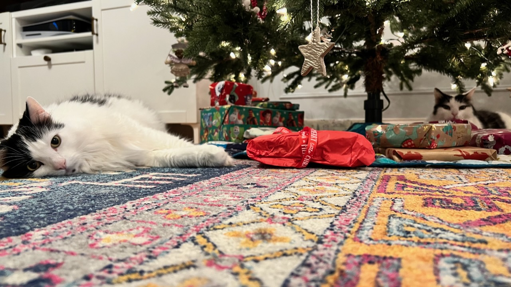

Last weeknotes of the year. Andrea and I were reflecting on something the other day, and we realized how hard it is to separate 2020 from 2021. There were some big, obvious, very good differences between the years but in terms of how things got filed away mentally they didn’t get their own boxes. For me 2020 continued until April / May, when Lorelei went to in-person school, I started a new job, and the adults started getting vaccines.

One good thing though, I can actually look back here and figure out what happened when!

**Personal highlights:**
- Started a new job at [Chewy](https://www.chewy.com). It’s better than the old job. I’m old enough now that calling out when things got better and not worse is worth mentioning!
- Redid the kitchen and [fancied up the back yard](https://www.builtwith.coffee/blog-posts/2021/06/weeknotes-for-the-week-ending-june-20).
- Sent the kid to school with other kids.
- Stayed [married for 10 years](https://www.builtwith.coffee/blog-posts/2021/08/weeknotes-for-the-week-ending-august-29-2021).
- Got back into [mountain biking](https://www.builtwith.coffee/blog-posts/2021/09/weeknotes-for-the-week-ending-september-05-2021). Strava says I put 60 miles on the bike, but more importantly all but two of those rides were with friends.
- Got [a little into Fortnite](https://fortnitetracker.com/profile/all/Verycoolperson88).

**Meta highlights**
- I updated my [about page](https://www.builtwith.coffee/about).
- I switched from [Netlify CMS to Forestry ](https://www.builtwith.coffee/blog-posts/2021/02/from-netlify-cms-to-forestry) and then gave up on both. I’m currently trying [Frontmatter](https://frontmatter.codes) in VS Code out. I’m about two more annoyances away from making my own CMS.
- I started doing weeknotes [mid-May](https://www.builtwith.coffee/blog-posts/2021/05/weeknotes-for-the-week-ending-may-16-2021) and haven’t missed a week[^1]. After doing it for a year I’m a) glad I did, because I just read through all of them and there was a lot I had forgotten and b) would like to move away from them next year and instead write more often, and break events/thoughts into their own posts with useful titles.
- I added the “recommended” button on my [reading list page](https://www.builtwith.coffee/books).

### etc
- Christmas! We don’t make a big deal of it here. I made cinnamon buns from a recipe my dad adapted from a King Arthur Flour cookbook that seems to not exist on their website. It’s basically: make dough, fill with sugar and nuts, stuff in face, but if you want the actual recipe just ask me. It seems easier than the ones they do have on their website.

- We started watching season two of _The Witcher_. It’s good, it’s not amazing. I really liked the first episode which was it’s own little story, but the season-wide plot is too high fantasy “it’s the end of the world as we know it” boring. The game had the same problem. I just want a _Columbo_ style _The Witcher_. Which of the townfolks turns into a monster at night? What clues will give it away? How great would Geralt angrily mumbling “one more thing” sound?
- We also started watching _Station Eleven_. I read the book a long time ago and enjoyed it, the TV show is different but good in its own way.
- Dave Barry’s humor is a hand-me-down from my dad, but at least unlike Scott Adams he didn’t turn out to be a terrible person and I still enjoy his yearly reviews in WaPo: [Dave Barry’s 2021 Year in Review](https://www.washingtonpost.com/magazine/2021/12/26/dave-barrys-year-review-2021/?itid=hp-top-table-main)
> Another improvement was that most stores got rid of those one-way anti-covid arrows on the floor. Remember those, from 2020? You’d be halfway down a supermarket aisle, and you’d realize that you’d gone past the Cheez-Its but you couldn’t turn around and go back because you’d be going AGAINST THE ARROWS, which meant YOU WOULD GET COVID.

[^1]: I don’t think I did, anyway. Making a view of the site that’s calendar is on my todo list. I made the calendar for the [album a day project I gave up on](/album-a-day) so it’s half done.