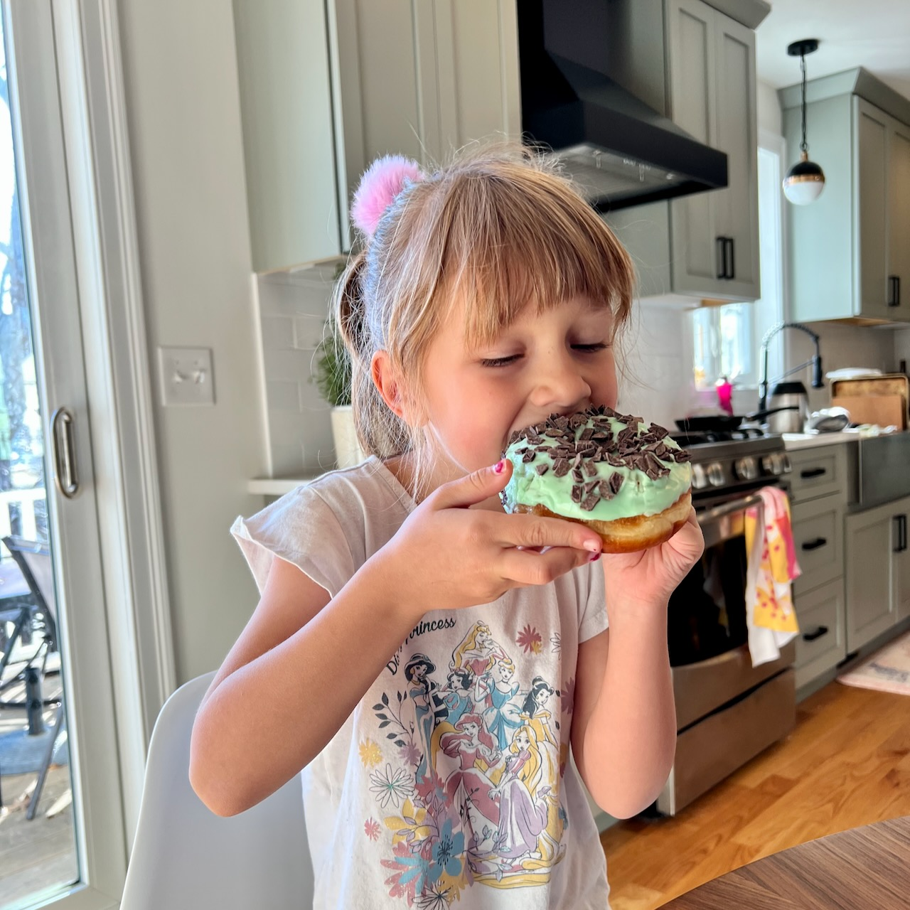
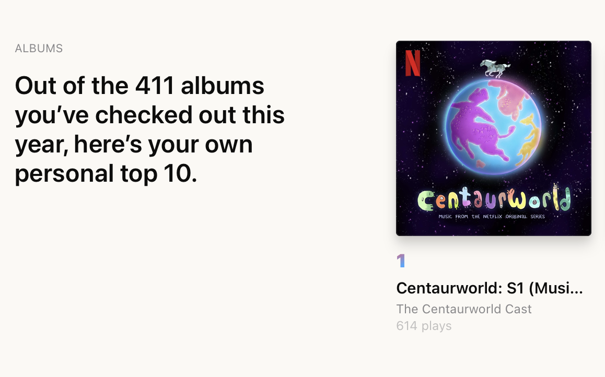

Added a December folder. I also spent some time looking for a previous post on this site that I thought existed, but it doesn’t. I can search the files that make up this blog in [iA Writer](https://ia.net/writer), but maybe it’s time to figure out a search feature for the site itself.

### Dusty Domains
Netlify is doing this [Dusty Domains](https://dusty.domains) thing and I have a domain which is not _that_ dusty but for some reason I bought it and now it’s a website, so please enjoy [whatisannft.digital](https://whatisannft.digital).

### Second shot snacks

Lorelei got her second shot so we celebrated with donuts from [Half Baked Cafe](http://halfbakedbeverly.com).

### Replay (and replay, and replay)
Apple Music has their year end [personalized replay lists](https://music.apple.com/replay) thing up, and this is a highlight from mine:

Yeah, we like [Centaurworld](https://www.netflix.com/title/80992673) in this house. We’re very excited for Season 2 tomorrow. You will often hear one of us say “none of us are comfortable until we are all comfortable” (watch from below if you have no idea what I’m talking about. Then go back and watch the entire show).

<iframe width="560" height="315" src="https://www.youtube.com/embed/6eSmKiTbwcY?start=2421" title="YouTube video player" frameborder="0" allow="accelerometer; autoplay; clipboard-write; encrypted-media; gyroscope; picture-in-picture" allowfullscreen></iframe>

### How long will browsers be the UI target of choice
Microsoft Edge released a [Buy now, pay later](https://techcommunity.microsoft.com/t5/articles/introducing-buy-now-pay-later-in-microsoft-edge/m-p/2967030) feature. I only knew from Twitter because, why would I ever run Edge. But more to the point, how far are we from when browsers are their own compile targets. We’re close enough already with web to native frameworks, why not just reduce everything to `<BuyButton>` and let a compiler figure out what that turns into.

Sometimes, and not enough to keep me up at night, but sometimes, I think browsers are getting boring, the same e-commerce and silo’d text update websites being given all of the priority. Other times I find things like [this demo of Townscaper that runs in your browser](https://oskarstalberg.com/Townscaper/). There’s still “cool” stuff being made for the web, but there’s a heavily biased incentive to build things that feed the beast, and if AR and VR grow like some companies hope they will, I can only see the monetization wedge being driven even deeper.

### etc
Reading this week that was interesting:
- [Book Notes: “An Essay on Typography” by Eric Gill - Jim Nielsen’s Blog](https://blog.jim-nielsen.com/2021/book-notes-eric-gill-typography/)
- [How This All Happened · Collaborative Fund](http://www.collaborativefund.com/blog/how-this-all-happened/) from [Daring Fireball: ‘How This All Happened’](https://daringfireball.net/linked/2021/12/02/housel-how-all-this-happened)
- [How to rest well](https://psyche.co/guides/how-to-rest-well-and-enjoy-a-more-creative-sustainable-life)