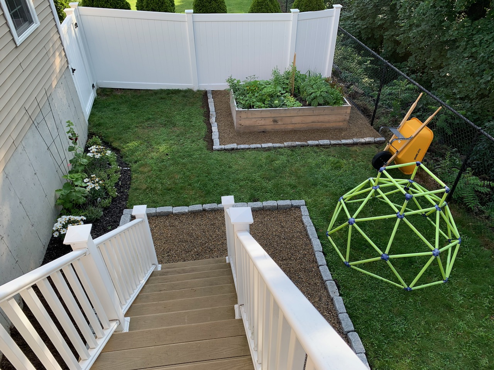

- I spent too many hours dealing with an issue where a previous employer off by one’d my social security number. Double check it! Also, I wonder who this person who is me shifted once is.
- Safari will be the death of me. Our app at work was using IndexedDB to store state, and I saw this in my timeline: 
<blockquote class="twitter-tweet">
Ran into a spectacularly awful Safari bug in the latest Safari (14.1.1 on macOS and iOS 14.6).  Opening an IndexedDB database fails 100% of the time on the first try. 😩  If you refresh, it starts working.  Bug report: <a href="https://t.co/I61x27obtv">https://t.co/I61x27obtv</a>  cc <a href="https://twitter.com/webkit?ref_src=twsrc%5Etfw">@webkit</a> <a href="https://twitter.com/chris_dumez?ref_src=twsrc%5Etfw">@chris_dumez</a> <a href="https://twitter.com/Apple?ref_src=twsrc%5Etfw">@Apple</a>
&mdash; Feross (@feross) <a href="https://twitter.com/feross/status/1404568122158313474?ref_src=twsrc%5Etfw">June 14, 2021</a></blockquote> 

But, ok, that’s fine, we were refactoring the app and saving less state in browser storage, and we were going to use localStorage instead because cross-tab communication is easier but haha fuck me right?

<blockquote class="twitter-tweet">
😬 localStorage is broken in Safari 14.1.  Tabs end up with seperate localStorage for reading, but the same localStorage for writing. This will likely result in data loss for users. (h/t <a href="https://twitter.com/forresto?ref_src=twsrc%5Etfw">@forresto</a>)<a href="https://t.co/5Ljxl4vvbH">https://t.co/5Ljxl4vvbH</a>
&mdash; Jake Archibald (@jaffathecake) <a href="https://twitter.com/jaffathecake/status/1389493762129375232?ref_src=twsrc%5Etfw">May 4, 2021</a></blockquote> 

I use Safari on a day to day basis because it is fast, but also because there’s no better way to find out what dumb things are broken in Safari that will break your app than seeing it broken in someone else’s app. Oh and forget Google Lighthouse, you want to know if an app is good just open it in Safari and see if you get the “this page is consuming significant energy” warning.
- Being generally mad at computers due to the above I’ve gone back to taking notes on paper again. I have a stack of index cards on my desk and I write what ever pops up and deal with it later. I have nice [Zebra highlighters](https://www.zebrapen.com/mildliner/) to go over the notes at the end of the day and flag things that are important.
- Our [backyard patio project](https://www.builtwith.coffee/blog-posts/2021/06/weeknotes-for-the-week-ending-june-20) left us with a stack of extra cobblestones and a pile of extra pea gravel, so I dug up some more of the yard and made a nice border around our garden bed.

This used up exactly all of the material, and the grass there is now pleasingly geometric so we’re done with that part of the yard.
- I was drinking coffee on the back porch this morning and the air had an intense low-tide smell. I know it’s like 1% salt and 99% dead plants and animals but I love it. I took out the bike and rode down to beach, and it was one of those days where when you get to the road that runs along the beach you can feel the air change, it was colder and denser (and… the smell!).
- I dream of car-free Sundays in town. If you get out before 10 in the morning there isn’t a tremendous amount of traffic but being able to roll down any street without having to check for cars would be 💯.