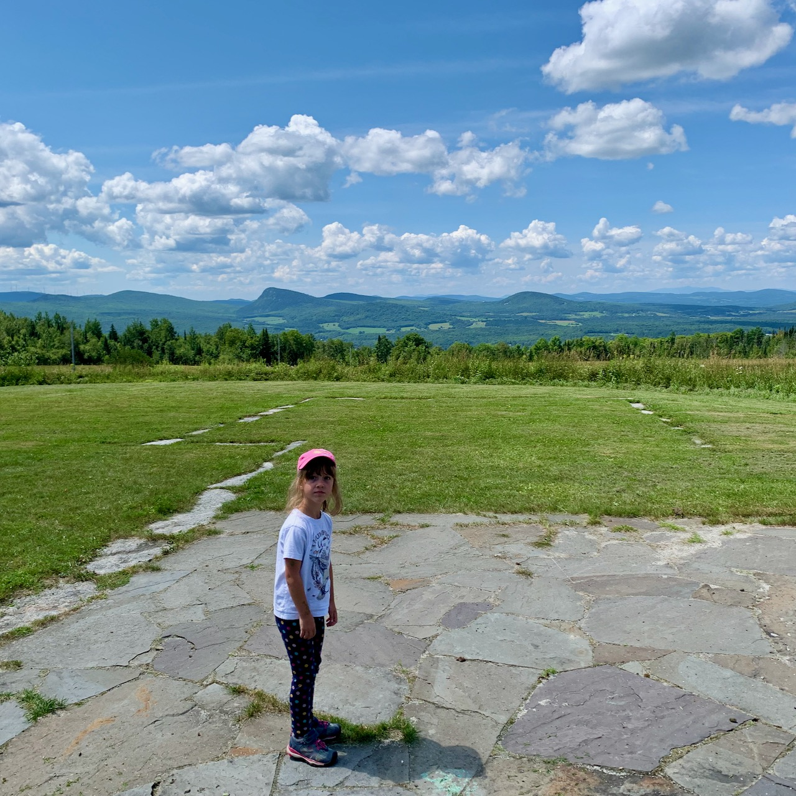

- I set up a suite of tests on a project I’m working on at work that uses [Cypress component tests](https://www.cypress.io/blog/2021/04/06/cypress-component-testing-react/). This might be the most perfect testing solution for me. I like Cypress for e2e tests, and the component tests allow you to use the syntax but mount slices of your application for testing. Not only does it mesh nicely with e2e tests, it makes testing pieces of your application visually without having to invoke the entire application on a dev server a piece of cake.
- Finished [The Light Fantastic](https://www.indiebound.org/book/9780062225689) by Terry Pratchett. Not my favorite Discworld novel but we got it from a library book sale for a few pennies.
- Our kitchen has a sink again! It’s big and wonderful and I never want to see a double basin sink again.
- We took up a trip to Vermont for the weekend to see my parents who, intentionally or not, live up there in the Summer. Long trip up in the dark, but we had beautiful weather all day Saturday so I’m glad we didn’t wait until Saturday morning to make the drive.
- We took a “hike” at [Sentinel Rock State Park](https://fpr.vermont.gov/sentinel-rock-state-park). It’s maybe a half mile through a field from the parking lot, but it was a good distance on a lazy-day.

- My daughter spent a lot of the morning and early afternoon catching (and releasing) bugs. It’s absolutely crazy how many fewer bugs there are up there then there used to be. My dad remarked how when we drove up in the 80s and 90s, the car would be covered in dead bugs. Now? I think I hit two.

- It’s our 10th wedding anniversary (soon) so we wanted to stop by the place we were married.

- As I said, beautiful weather on Saturday…

And then much less beautiful on Sunday.

Which is fitting, I think, since we had a beautiful day on our wedding, and then the remnants of Hurricane Irene blew in the next day and it was windy and gross.
- I planned ahead more than usual for the drive and we stopped at better restaurants on the trip up and back. [The Common Man](https://www.thecman.com/common-man-windham/) on the way up, and [Dos Amigos](https://www.dosamigosburritos.com) on the way back, with a stop at [NH Doughnut Co.](https://www.nhdoughnutco.com) for some post ride treats.
- Traveling with an unvaccinated kid is more stressful than it  needs to be because you have no idea who actually has or hasn’t gotten vaccinated. Leaving Vermont we passed some clown show setting up that was demonstrating for keeping the government out of their veins or whatever bird brain idea they had.
- I had a little project waiting for me when I got back. The wired mouse had been driving me crazy, so I ordered a new wireless one and figured while I was there, why not color match the mouse to the keys on my keyboard.

