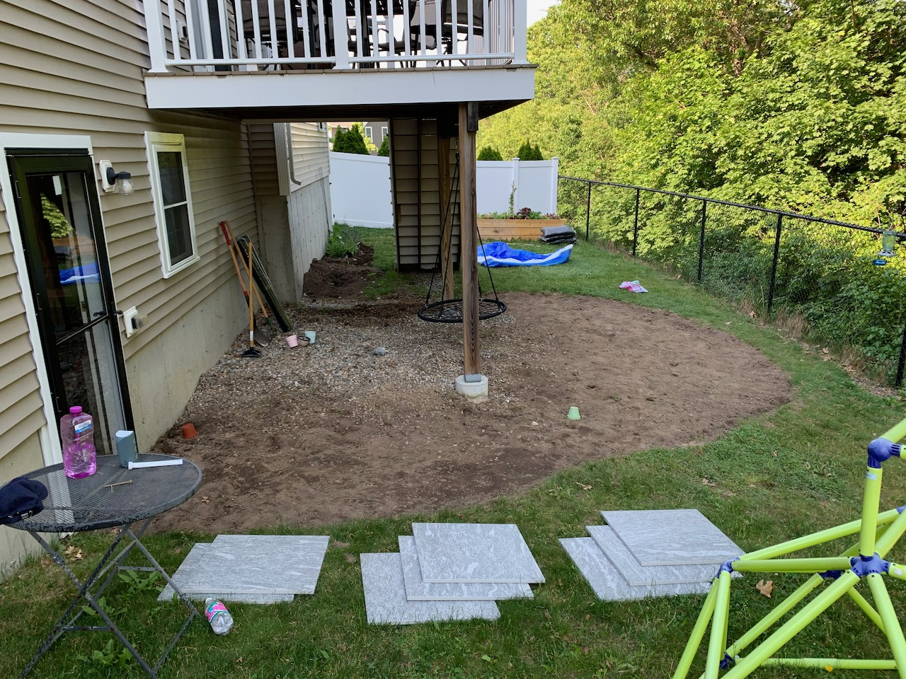
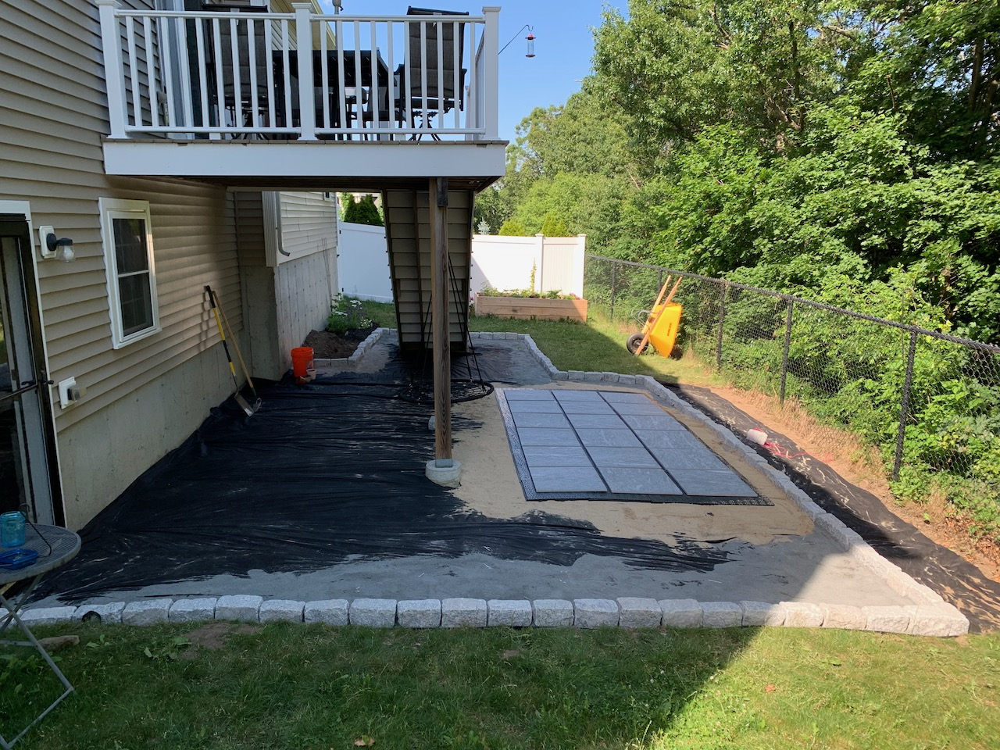

- Watching more TV than usual around here. Went through the entire first season of [Sweet Tooth](https://www.netflix.com/title/81221380), and now I have to go back and read the comics. I remember the end of the world events being more vague in the comics, they’ve added detail to the TV series but I’m not sure the details make logical sense. Still, I adored the comics, and the first season does a pretty delightful job of bringing it to life (Bobby is…much cuter). Also watched [Bo Burnham: Inside](https://www.netflix.com/title/81289483), also good. If you want to be convinced to watch it, just watch _Welcome to the Internet_ here:

<iframe width="560" height="315" src="https://www.youtube-nocookie.com/embed/k1BneeJTDcU" title="YouTube video player" frameborder="0" allow="accelerometer; autoplay; clipboard-write; encrypted-media; gyroscope; picture-in-picture" allowfullscreen></iframe>

- Read [Nothing To See Here](https://www.indiebound.org/book/9780062913463). It’s about raising kids who spontaneously combust, which, if you’re a parent, you can immediately recognize is really just all kids. The book included this article at the end, which resonated with me: [I Was Worried My Anxiety Would Prevent Me From Being a Good Father. My Sons Changed That](https://time.com/5712486/parenting-with-anxiety/)
- Finished [Ori and the Will of the Wisps](https://www.nintendo.com/games/detail/ori-and-the-will-of-the-wisps-switch/). Great game, one of the few games out there where your character’s movements make you feel super powerful (Spiderman on the PS4 is another one that comes to mind). I wish the Switch Pro controller had a headphone jack because _Ori_ has beautiful music but I had it on low volume since I was playing after the kid was asleep.
- More yard work. This was the end of last weekend:

This is where we are after this weekend:

It’s so close! And by close I mean many tons of pea gravel away from close!

## Album a day
I took a break for vacation last week, and apparently forgot to update the last week of May… but now I’m back. [The full list remains here](https://www.builtwith.coffee/album-a-day).
- June 13: [Early Songs & Rarities by The Record Company](https://music.apple.com/us/album/early-songs-rarities/1504326889)
- June 12: [‎Wakin On a Pretty Daze by Kurt Vile](https://music.apple.com/us/album/wakin-on-a-pretty-daze/598989281)
- June 11: [‎No Gods No Masters by Garbage](https://music.apple.com/us/album/no-gods-no-masters/1556301766)
- June 10: [‎Song of the Lark and Other Far Memories by Angel Olsen](https://music.apple.com/us/album/song-of-the-lark-and-other-far-memories/1558244877)
- June 9: [‎Locked Down - Live from Brighton Electric by Juanita Stein](https://music.apple.com/us/album/locked-down-live-from-brighton-electric/1564499406)
- June 8: [‎Jubilee by Japanese Breakfast](https://music.apple.com/us/album/jubilee/1553364590)
- June 7:  [‎Blue Weekend by Wolf Alice](https://music.apple.com/us/album/blue-weekend-apple-music-edition/1569497531)
