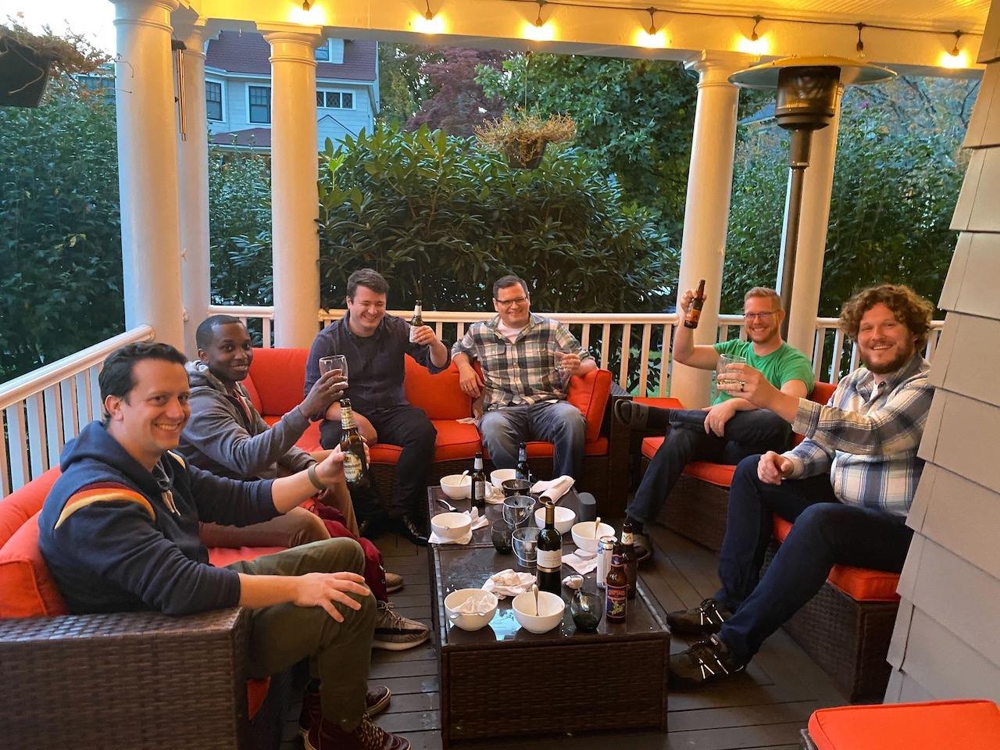

Let’s start with a riddle: 
Q: What do a couch and a baby have in common? 
A: If you want one now, you have to wait 10 months.

### The Jordan’s HyperMegaSuperstore
We purchased an Ikea sectional when we moved into this house not many years ago. It was fine, it filled the space we wanted to fill, but lately it’s become spine-tinglingly uncomfortable[^1]. We went to the Jordan’s superstore which is… definitely not one of my favorite places on Earth, but the combo of nice weather / COVID / and the fact that every scrap of furniture upholstery is sitting in a cargo ship currently lost in the middle of the Pacific meant there was hardly any one there. We ordered some new couches and a chair and they’ll be in our house (🤞) before I die.

Since it was pretty empty, we took Lorelei to do the [crazy indoor ropes course thing](https://www.beanstalkatjordans.com) they have there. The excitement of it was enough to get her into the harness and up to the first level, but after a few crossings I got two big thumbs down while she held on to one of the landing posts.

After that she came down and did the _much closer to Earth_ version a few thousand times.

### Oktoberfest
The team got together in Woostah on Monday. This is the third time I’ve seen them IRL since starting at Chewy. The entire team has joined during the COVID <s>lockdown</s> <s>year</s> era.

### Getting into the Spirt of the Season
Growing up we had a few people in the neighborhood I trick-or-treated in who would take things too seriously. Like, put on a hockey mask then hide in a leaf pile with an actual chainsaw seriously. So, I’ve always been a fan of more sedate Halloween decorating. A few pumpkins, maybe some sugar skulls, a couple of leaves I failed to rake blown about. Lorelei had a specific request for spider webs this year. Sure, why not. I had to go to Home Depot anyway, so I brought her along, thinking they always have a seasonal display with some decorating stuff in it. Well, apparently the “season” appropriate for October 15th is Christmas. But! It’s 2021, and “thanks” to COVID there are hundreds of empty retail stores out there for [Spirit](https://www.spirithalloween.com) to sink its creepy claws into. So we found one of those, which, amazingly I don’t think I’ve ever been in. They had an entire rack full of decorative spider webs. The store had probably the most people I’ve seen in a retail establishment since the beginning of the the COVID <s>lockdown</s> <s>year</s> era. We passed on the 7+ foot animatronic [Baphomet](https://www.spirithalloween.com/product/decorations/animatronics/7-6-ft-baphomet-animatronic-decorations/pc/1005/c/0/sc/1011/222779.uts) but man for $300 that puts the animatronics in some local theme parks to shame.

### etc
- [Johnny Decimal](https://johnnydecimal.com). I like the idea of it, I’ve been getting better about keeping folder structures the same in any given context, e.g. Things has areas and projects under it, my notes app has the same areas and same projects, the folders under iCloud have the same areas, etc. I like the idea of adding numbers in, if only to remind you that you need an upper limit on how many things you can keep in your head.

[^1]: Or, I’m getting old. Or it’s both. 