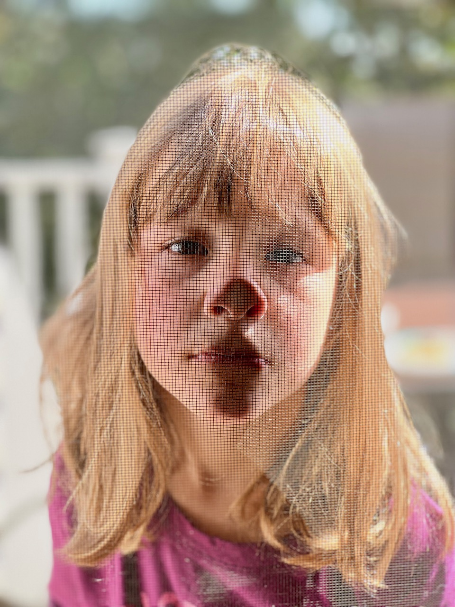

### Get in the pit

Went to a concert for the first time since COVID. The show was [Crazy & The Brains](https://crazyandthebrains.net) (first punk band I’ve seen use a xylophone), [Bridge City Sinners](https://www.bridgecitysinners.com), better explained in their own words:

<iframe width="560" height="315" src="https://www.youtube.com/embed/_tCvb39Lt7k" title="YouTube video player" frameborder="0" allow="accelerometer; autoplay; clipboard-write; encrypted-media; gyroscope; picture-in-picture" allowfullscreen></iframe>

And [Days N Daze](https://daysndaze.net), short one member, but made up for with some mouth trumpet and backup from the previous bands.

Two notes:
- I think this was the biggest crowd I’ve been around since the last show I saw at the Middle East, in January of 2020. Go big or go home, I guess.
- I adore that no one in Cambridge cares about other people _at all_. It’s already pretty on-brand for New Englanders to ignore other people, but when a person in a skull mask, leather jacket with studs, and a kilt can walk around with no one saying anything, that’s perfect.

And shoutout to Dan for getting the tickets and convincing me to leave the house. We both acknowledged it’s a lot harder these days.

### Professional
An iPhone 13 Pro showed up this week. I wasn’t planning on upgrading my XR (it was fine), but the AT&T trade-in for a decent amount of money only to be mind-controlled by them for the rest of your life[^1] was hard to pass up. Also, the number of cameras. My XR was definitely lacking in [Fuck Everything, We’re Doing Five Blades](https://www.theonion.com/fuck-everything-were-doing-five-blades-1819584036) energy.

So far that camera has been great for taking pictures of my child who finds the most adorable faces to make.

 

### etc
Just posting this for posterity, so some day my kid can find this and know that I was good at video games (some times, when other people are bad).

<iframe src="https://player.vimeo.com/video/638454126?h=c6695513d2&amp;badge=0&amp;autopause=0&amp;player_id=0&amp;app_id=58479" frameborder="0" allow="autoplay; fullscreen; picture-in-picture" allowfullscreen style="position:absolute;top:0;left:0;width:100%;height:100%;" title="fortnite-endgame.mov"></iframe>

[^1]: I was just pushed an update (over 5G, of course), that informed me this is not true.