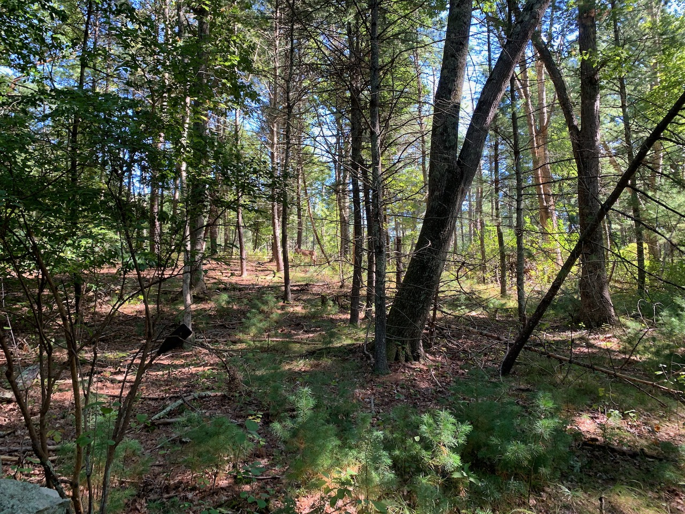

It’s October. The wife and I had Friday off, and thought maybe we’d get lunch in Salem. We didn’t really think October 1st, a full 30 days away from Halloween would be an issue, but people take October being spooky season seriously. Instead we ate lunch in town, which is another town that used to be part of Danvers, which is where the “Salem” Witch Trials took place, but don’t tell the tourists that.

### A Leaf on the Wind, and The Good Lord Bird.
Before attempting lunch on Friday I went out for a bike ride. One of my favorite things when mountain biking is unintentionally sneaking up on wildlife, slipping through the trees quickly and quietly enough that they don’t notice you until you’re close, and then they jump and run off. Happened with a few deer, but the treat was a Pileated woodpecker jumping off a tree and flying in front of me for a few hundred feet.

_Find the deer. Someday I’ll have a phone with a telephoto lens._

Related, an article I read this week about the [Ivory-billed woodpecker being declared extinct](https://www.vox.com/down-to-earth/22700280/extinct-animals-birds-biodiversity-loss). As a kid I had a t-shirt that was treated so that when it was cool the silhouettes of dozens of animals were on it, and when it got hot, they disappeared. This wasn’t even a commentary on global warming, it was just — hey, stop tearing down the places these animals live. But, they’re probably all gone now.

> By some estimates, populations of mammals, birds, amphibians, reptiles, and fish have declined by almost 70 percent on average since 1970. It’s the reason you tend to see fewer bugs on your windshield when driving cross-country and hear less birdsong when hiking through the forest. 

Also how many animals died to make a t-shirt treated with some heat sensitive chemical. I am not a biozoologist but I want to say the Earth having almost 70% fewer types of things living on it is bad.

### Everything is crap

> There’s just so much crap being offered for sale or rent today — so much that we’re expected to spend money on and like even though it’s incompetently or carelessly made.

From [Snake and Ladders](https://blog.ayjay.org/criterion/) by way of [Rhoneisms](https://www.patrickrhone.net/10797-2/). We’ve been looking at furniture lately and:

1. You can’t even get it because [supply chains are fucked](https://www.washingtonpost.com/business/interactive/2021/supply-chain-issues/).
2. It’s nearly impossible to distinguish crap from not-crap. Furniture brands are spun up out of the ether to repackage the same item at different price tiers, and with so many of the stores going all online, the details of the quality of the fabric, stitching, construction, are passed off to the reviews of previous buyers, who may or may not be real.

I take back that _everything_ is crap, but the [paradox of choice](https://en.wikipedia.org/wiki/The_Paradox_of_Choice) only serves to make me think that, by default, something is crap unless proven otherwise.

### etc
If you follow me on RSS (or, simply look at the post below this one), you might have seen some odd things pop up. For a while I’ve wanted to be able to post to here “like Twitter”, i.e. from my phone and as easily as possible. The entire site is driven from Markdown files in Git, so I hooked up a [Netlify function](https://functions.netlify.com) to take in a JSON POST body and send the picture to an S3 bucket and the content to Github as a new commit on `main`, and an iOS Shortcut to export a photo from Photos and allow me to append some text to it. And it works! Mostly! I don’t delete my mistakes, so if you click on “permalink” on the post below it, uh, goes nowhere. Once it goes somewhere I’ll write up some details on how it works.