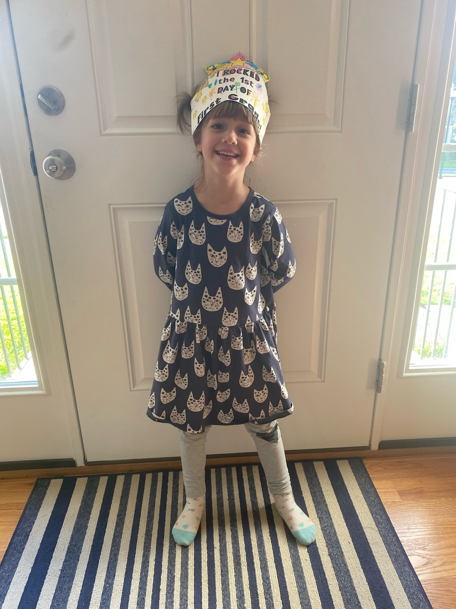
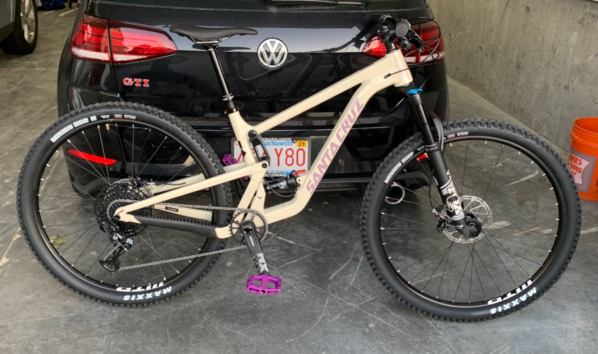

### First day of first grade

Started another school year. We’re doing in person this year, and Lorelei (and we) are much happier about that. The town didn’t have open arguments about mask usage, and the kids don’t seem to mind wearing them, and most of the parents seem reasonable around here, outside of some S-tier dumb-assess who showed up to the meet-and-greet day wearing AR-15 apparel[^1]. 

If you think of everything in seasons, this Fall feels more optimistic than last Fall. Less “this isn’t what I wanted” and more “this isn’t what I expected” which is par for the course of life.

### NBD (new bike day)

_Last time it’ll ever be clean._

I’ve been biking nearly as long as I’ve been walking, and mountain biking only a bit less than that, but for the last few years I’ve been without a mountain bike. The last one I had was a Santa Cruz Nickel frame that I had slapped hand me down parts on, which was a nice enough bike, but it went into storage for a while and when it came out I realized a lot of those parts needed to be replaced, and if I was going to do that, wouldn’t it make more sense to buy something newer with bigger wheels? Sure. So I sold it, and then put off finding its replacement thinking, well, there’s house projects that need funding, and how often do I really have time with a kid, and all other excuses. I finally decided to look at getting a new bike in 2020 but… they all quickly disappeared. This Summer I finally said I’m going to find _something_ and kept tabs open at all the local shops and online, and found this 2021 Tallboy on [evo](https://www.evo.com) that’s likely a hold over shipment from last years orders. I’ve been out on two rides, and it’s a lot like the Nickel but with bigger wheels, so in the end I got what I wanted. I will add, mountain biking has gotten harder in the last 4 or 5 years that I’ve been away from it. Like, the mountains [^2] got bigger, or all the rain this year really washed out a lot more roots. It’s definitely not me being older or more out of shape.

### etc
Finished [A Children’s Bible](https://www.indiebound.org/book/9781324005032) by Lydia Millet. Years of Catholic schooling has left me a fan of ominous, religious literary fiction. This book mixes a few themes: the failings of the generations who came before us, global warming and the changing climate, the separation (or lack thereof) between religion and science. It doesn’t pull them altogether in one driving plot action, but neither does the Bible, so I think that’s the point.

I mentioned [last week](https://www.builtwith.coffee/blog-posts/2021/08/weeknotes-for-the-week-ending-august-29-2021) I re-did my [reading list page](https://www.builtwith.coffee/books) to pull from the Notion API. I just realized that while it works wonderfully on localhost, the images don’t actually show up here. Something to add to the todo list.

[^1]: One had a particularly dumb slogan on it, so I [looked it up](https://www.lionsnotsheep.com) and… yeah. Let me tell you I never feel like a FREE person until I put on my $35 sloganized t-shirt. I’m sure they do some great advertising on Facebook. 
[^2]: “Mountain biking” in seacoast Southern New England is a bit of a funny term. “Small hill filled with tree root biking” would be the better term.