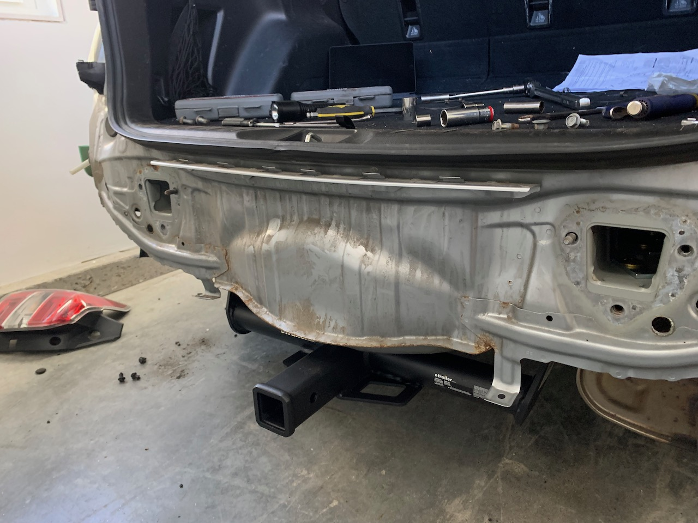
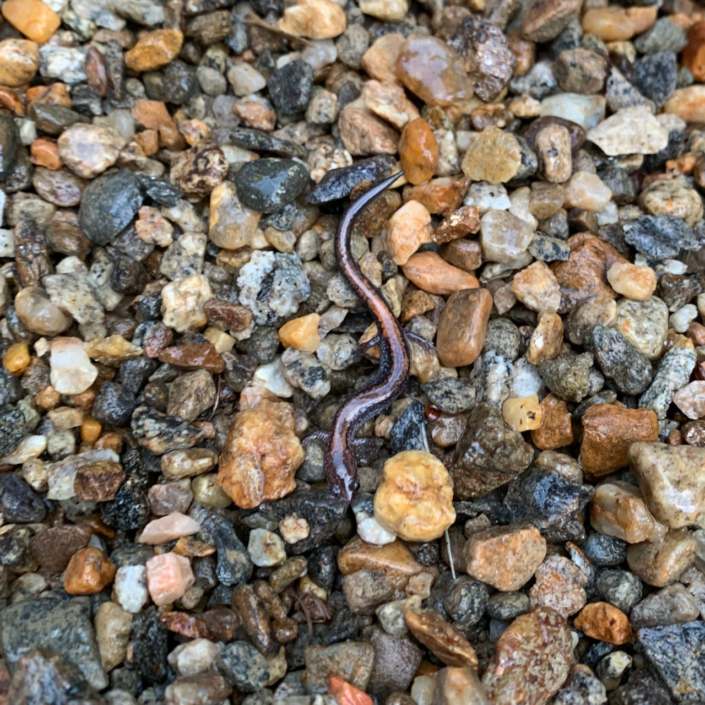

### iOS 15
I upgraded all of my iDevices to iOS15 (or… whatever their equivalents are called. tvOS/HomeOS _something-point-oh_). A few quick notes:
- **The hassle of micro-services, in your own home!:** I had a home automation that was set to turn the lights on at 7:30am. When I set it up, it worked! Later, it stopped working. The lights would turn on at 10:30am. Clearly a timezone issue, but from what? Not my phone, the Hue app and hub seemed to think it was in the same location as us. I checked the HomePod, also EST, updated it and it started working at 7:30am again. Until this week, when it went back to 10:30am. I finally figured out that the Apple TV was set to its original Cupertino time zone (why, though?) and depending on some magical cloud logic the Homepod and Apple TV would switch off being the “home hub”.
- **Don’t remind me:** I used to run the iOS betas on my iPad. I used to use Apple Notes and Reminders. That is, until one iOS update required redoing the Reminders database, and the Reminders app was out of sync between my devices until a new version of iOS and MacOS were released. That was years ago, and yet that remains a problem today. You added tags to your reminders and made a smart list? Neat, you can see them on your Mac in a few months. Maybe, assuming MacOS releases on time. It’s worth it to use 3rd party replacements for both of those apps because you’ll at least get major updates across platforms all at once. It is insane to me that Apple still ties minor software updates to major OS releases. I will acknowledge that they gave us Safari 15 early, but the system browser being tied to the operating system was a bad idea 20 years ago so let’s not be too impressed.

Beyond those gripes, there’s a ton of low level quality of life improvements. The new maps font is nice. Widgets on the iPad are great (although I wonder why it took an extra release to get them), and the redesigned multitasking UI makes it much more usable. The UI team working on the Weather app is amazing.

### Hitchin’ a ride

I put a trailer hitch on our Forester on Saturday. I wanted a hitch mount rack for the [new bike](https://www.builtwith.coffee/blog-posts/2021/09/weeknotes-for-the-week-ending-september-05-2021) - it’s way too long and heavy for me to easily get on and off the roof rack, but that necessitated having a hitch to put the hitch rack on first. I decided to do it myself because sometimes I enjoy working on cars, and I found a [version of the install that](https://www.subaruforester.org/threads/no-drill-curt-hitch-install.374929/) that involved no drilling, only wrenching. Some thoughts:

- I used to work on cars a lot. I used to be under my first car (a Subaru WRX) all the time, to the point where almost nothing on that car was original. I used to throw it up on jack stands, hip check the car to make sure it wouldn’t fall off, then dive under it. I would never, ever consider that these days. Somewhere between that car and this car I had cars where I did work on them because it was “cheaper” and messed things up (in occasionally catastrophic ways). These days I stick to easy bolt-on or rewire improvements.
- If you’re not someone who works on cars: modern cars are a frame and 40,000 plastic clips holding the body on and that’s it. I had my daughter come out and help put the bumper back on, at first she thought I had broken something (not a bad guess), then she assumed it was much too heavy for her to pick up, then she picked it up and noticed that it was “wobbling all over!”. I let her slap it into the clips along the edges and use a socket wrench to put in the two (!) bolts that hold it on.
- I ended up getting a [rockymounts MonoRail Solo](https://rockymounts.com/products/monorail-solo.html). Like everything bike related there were a ton of options and most of them weren’t in stock. I like this one because it only holds one bike. For some reason bike rack designers think everyone rides with friends and they drive to the trails together.

### Stop, don’t shop
- I’ve given up on Stop and Shop. I go there because it’s close, and during the pandemic they had lots of self checkout lanes so you could get in and out pretty quick. But now they’ve done something to the self checkout lanes that basically goes like this:

	1. Ring item.
	2. Open bag to put place item in.
	3. Place item in bag.
	4. Error that there is an unscanned item in the bagging area.

It’s… it’s the bag. Why would I put something in the bagging area and not put it in a bag? I don’t know what shit update they pushed recently that made this start happening but the only solution is to either pile everything into the 2’x1’ bagging area and bag it at the end, or get someone to wave their card at the machine every time you add a new bag.

And before you’re like “well it’s Stop and Shop, what do you expect” let me tell you the developers who made that change and the ones who write car automation software differ only in ambition, not intelligence.

### etc
- Alice Bartlett (whose weeknotes inspired these ones) had this [wonderful description of a particular website this week](https://alicebartlett.co.uk/blog/weaknotes-160):

> At some point I’m going to write something about how being a Tech Director for 6 months has gone. It’s gone well so maybe I should just leave it at that and save the rest of the psychopath’s playground (LinkedIn).

- We’ve had a little snake hanging out in our backyard. Lorelei and I went out this evening to see if we could find it. We didn’t, instead we found… baby snakes! 

