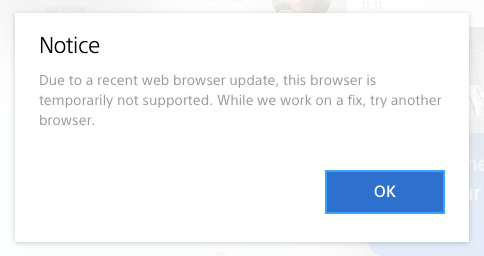

I’ve saved this screenshot for the next time I need to have a debate about dropping older browser support. It’s from [My PlayStation](https://my.playstation.com), and the browser is Safari (desktop and mobile!). Literally no way to view your account on an iOS device without downloading the app. Some light Google-ing says there’s over 100 million people with Playstation accounts so it’s unlikely I’m the only person annoyed by this.

