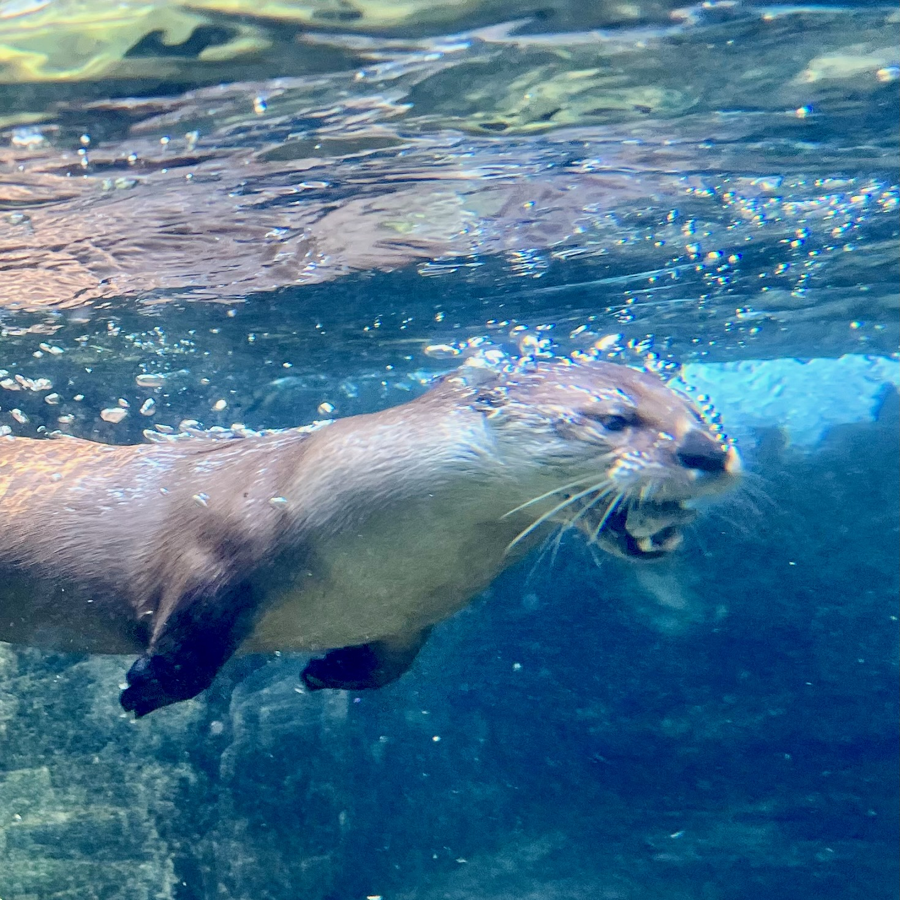
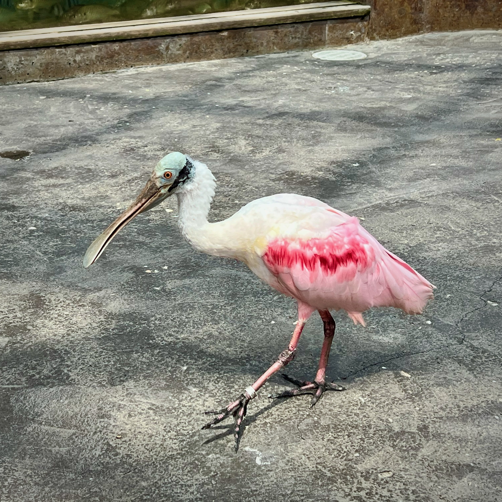
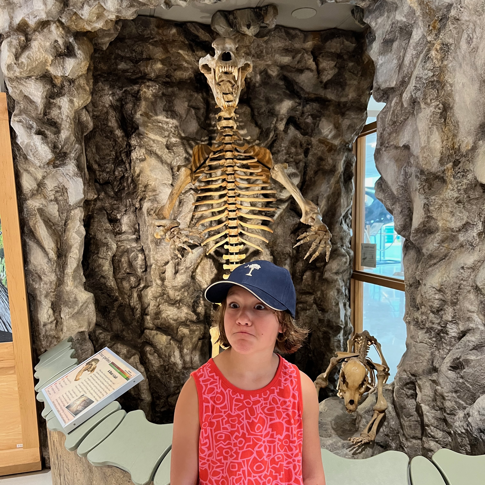
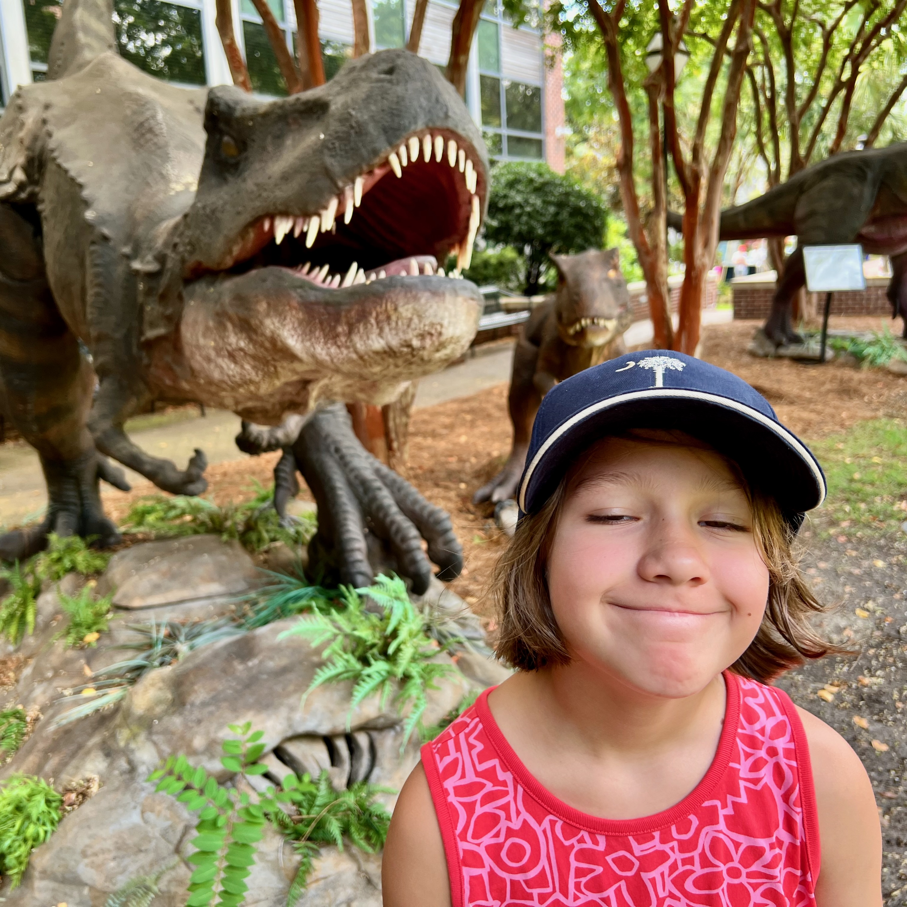
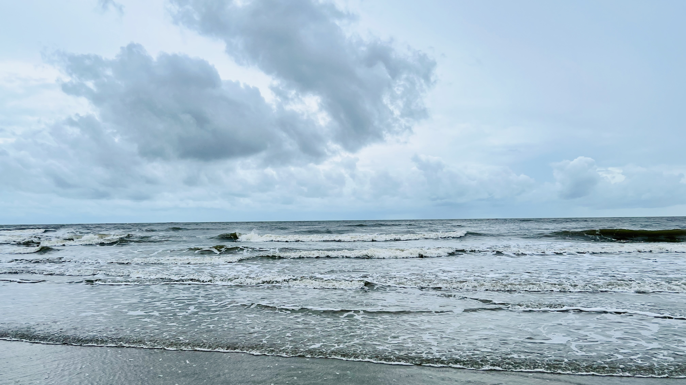

Got back from a late-Summer family trip to Charleston, South Carolina yesterday. While I was keeping an eye on hurricane Erin before we left, it ended up turning before the coast, and we had mostly great weather for the trip. Just the one day where we were caught in [flooding from record breaking amounts of rain fall](https://www.postandcourier.com/news/local_state_news/record-breaking-rainfall-high-tides-charleston-lowcountry/article_2460ee90-2555-4875-8476-ca40d804dd1b.html). My notes!

## Why Charleston
We enjoyed our [trip to Montreal](/blog/2024/trip-notes-montreal-2024) last year for two reasons: we got to explore a new city, and we had a hotel with a great pool.

This year late Summer worked better for our schedule, so I felt like it would be a great time to go to the beach. Maybe not for the entire trip, but at least some of it. I narrowed down options with these criteria:

1. Somewhere on the East Coast to cut down on travel time.
2. Somewhere with a beach near an interesting city.
3. Ideally somewhere off-season (kids in the South go back to school a few weeks before New England kids).
4. Somewhere warm enough where it feels “tropical”, which kinda meant South of Maryland.
4. Not Florida.

The three locations that I looked at were:
- The stretch from Williamsburg to Virginia Beach to the Outer Banks. Not to speak ill of 1/3 of the East Coast but nothing there really stood out to me.
- Savannah, Georgia and Hilton Head island. Hilton Head may be nice but it’s pricey. I want to visit Savannah someday but it seems like it might be more fun for day drinking in a park than traveling with a 10-year-old.
- Charleston, South Carolina. My parents visited the city a few years back and returned with good reviews, and it had multiple close beach options that looked nice.

So, Charleston took it.

## Transportation
Delta flys direct from Logan (BOS) to Charleston (CHS). It’s less than 2 hours in the air, and CHS is a tiny little airport that’s easy to get in and out of.

I didn’t want to rent a car, so we mostly Lyft’d / Livery’d to the hotels and walked to places. This was... ok. Many of the rides felt like we were passengers in a round of _Crazy Taxi_. Some of Charleston is walkable, and some of it you’re on a four-lane road with no shoulder and a sidewalk only slightly wider than a tightrope. There is a free bus system in Downtown, but I think I only saw it pass by once.

## Accommodations
We split the stay into two locations with three nights each:
- [The Mills House Hotel](https://www.millshouse.com) in Downtown Charleston. Great location, nice pool, decent food on premise, ok rooms.
- [The Sweetgrass In at Wild Dunes Resort](https://www.wilddunesresort.com/accommodations/the-sweetgrass-inn/). At the very end of Isle of Palms, about a 45 minute drive from Downtown Charleston. Great location for beach access, terrible for doing anything else in the area, nice pools, nice rooms, ok (and overpriced, but it’s a resort) food.

## Activities
I had similar plans for this trip as the Montreal one: pick a place to go to, then wander back to the hotel for pool/relaxing time. I planned on more pool time and less walking because it’s hot in Charleston at the end of August.

- [South Carolina Aquarium](https://scaquarium.org). Nice aquarium, if a bit small. I got to feed hand feed a sting ray.

_We caught otter feeding time, and the spoonbill wanted to be my friend._

- [Mace Brown Museum of Natural History](https://charleston.edu/mace-brown-museum/). Tiny museum inside the College of Charleston. I didn’t realize how small it was, we were in and out in under 45 minutes, but we had other plans in that area anyway so it worked out.

_Natural history museum or museum of silly faces?_

- [the Gibbes museum of art](https://www.gibbesmuseum.org). This was right next door to The Mills House Hotel. My original plan was to stop in here to kill some time between check-out and check-in at the two hotels. Interesting collection of art, and Lorelei liked the “life imitates art” set of photos next to some of the pieces where children/pets dressed up to match the art. While we were there we got a flash flood alert and hung out in the gift shop for much longer than planned, watching the sheets of rain fall and flood the roads.
- The [Isle of Palms beach](https://www.iop.net/beach). Either hurricane Erin or just the storm fronts parked off the coast churned up some nice waves to play in. Soft sand, warm waves, thumbs-up beach in my book.

_Wasn’t always sunny but it was always warm, and never crowded._

## Food
I have two complaints about food on this trip:

1. It’s absolutely impossible to gauge restaurants based on Google Maps / Yelp review scores any more. The places in our hotel got high 4-star reviews, and they were absolutely basic hotel food. Some of the places at the resort had been review bombed into the 2s based on “service”, but they were perfectly fine, could have been 4 stars anywhere else.
2. Never got good ice cream. I dunno if it’s too hot to make ice cream right in the South or something, but it was across the board disappointing. Maybe we have better cows up here.

Places we ate, of note:

- [82 Queen](https://82queen.com/#). Good Southern food. I had Chicken Bog, which sounds awful but the Andouille sausage was delicious and I’m going to figure out how to make it as it seems like a good one-pot dish.
- [Gaulart & Maliclet](https://www.fastandfrenchcharleston.com). I found this place because we were looking for something “snacky” and their charcuterie board sounded appealing, but we ended up ordering a bunch of things. They make fondue or other dishes partially at your table, the interior seating feels like you’re in someone’s kitchen, and they do chocolate fondue for dessert.
- [Brown Dog Deli](https://calhoun.browndogdeli.com). Good sandwiches. Decorated like someone stuck everything from my childhood closet on the walls so, I liked that.
- [Harken Cafe & Bakery](https://www.harkencafe.com). Breakfast place, good pastries.
- [Fleet Landing](https://fleetlanding.net). Food was fine, probably a fun place to sit on the back deck most of the time but we ended up on the side deck which had a limited view and was kind of hot, and they’re building a new hotel next door so our meal was occasionally punctured by the sound of someone driving rivets into a new pier. 

## Conclusion
Overall the trip was great. I think we realized we’re not “resort” people. Or maybe I’m not. I really like seeing new things then coming back to a hotel to relax. And we all like eating at interesting places, which is not really a thing you’re going to do at a resort unless you’re like, mega-super-rich and you get there on your own yacht.

But, Lorelei said the day at the beach was her favorite part of the trip, so I’m glad we got out there. If we do a city/beach split trip again I’d probably plan on staying in the city the whole time and doing a day trip (or two) to the beach. Ideally on a day without record rainfall.
