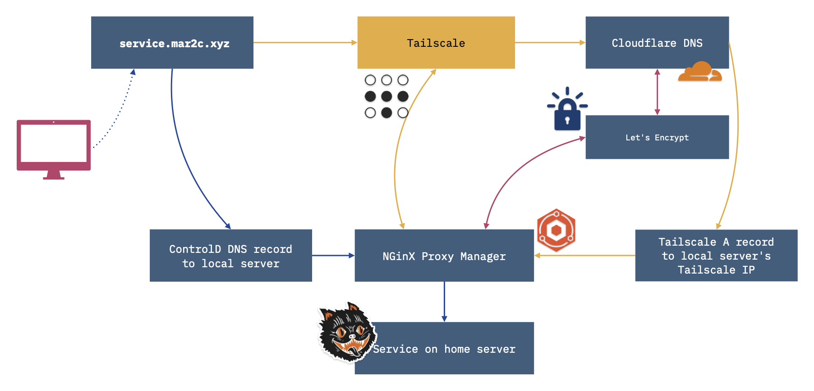

# DNS & [mar2c.xyz](mar2c.xyz)
After setting up my [homeserver](/blog/the-big-dumb-box-of-computer-parts-linux-edition/) I wanted to do something seemingly simple: visit `[service].mar2c.xyz` from anywhere and be able to reach that service on my home server via HTTPS.  
Here’s a breakdown of the steps to accomplish that.

## 1\. Buy a domain.

Use your favorite domain name registrar. I use [namecheap](https://www.namecheap.com) which is fine, but be aware that their intro prices can be wildly different from the renewal price. `.com`, `.org`, and `.net` are cheap but the name you want is probably taken. `.xyz`, `.club`, and `.website` are still relatively open and in some cases cheaper.

## 2. Use [Cloudflare for DNS](https://www.cloudflare.com/application-services/products/dns/).

If you’re following along with these steps exactly, use Cloudflare for the DNS. There are other options, but you want a service that can handle API requests for a [Let’s Encrypt DNS-01 challenge](https://letsencrypt.org/docs/challenge-types/#dns-01-challenge).

## 3\. Install [Nginx Proxy Manager](https://nginxproxymanager.com).

Nginx Proxy Manager is going to handle all the requests to our server as a reverse proxy, and manage Let’s Encrypt certificates for our domain. [Secure your websites with Let's Encrypt, NPM and Cloudflare](https://ryanfreeman.dev/writing/secure-your-websites-with-lets-encrypt-npm-and-cloudflare) is a good guide on gluing these pieces together, the important part being getting a Cloudflare API token that let’s you ****read**** Zones, Zone Settings, and ****update**** DNS.  
There are other reverse proxy options you can use, like [Caddy](https://caddyserver.com/docs/install). I happened to like NPM’s web UI, although for more complex setups I can see the appeal of Caddy’s Caddyfile format.

## 4\. Tailscale

The initial inspiration for this project was this video on how to remotely access your self-hosted services over Tailscale:

  

<iframe src="https://www.youtube.com/embed/Vt4PDUXB_fg?si=6WLzSIXVtFVEgbLa" width="560" height="315" title="YouTube video player"></iframe>

  

I’ll leave figuring out how to set up Tailscale for your service up to you. I upgraded my [Unraid](https://unraid.net) instance to [Unraid 7](https://unraid.net/blog/unraid-7-beta), which has Tailscale support baked in, so it was just a matter of toggling on an option in the Nginx Proxy Manager container, at which point I had a Tailscale machine name (and IP address).

  

The one part of the above video that never worked for me was using a CNAME in Cloudflare. But once I pointed my Cloudflare DNS A record to the Tailscale IP address of Nginx Proxy Manager I could reach any service Nginx was reverse proxying via HTTPS while using Tailscale.

## 5\. Local DNS resolution

Being able to get to a service over Tailscale is great, and works well for me, but let’s assume there was something I wanted to run that I wanted anyone in the local network to have access to without using Tailscale.

  

For that, you need some local DNS resolver to point to the local IP address of Nginx Proxy Manager, and it’ll all work as expected. There’s a few options here:

  

1.  If your router supports it, map a redirect there. Since I use an eero mesh network, this wasn’t an option.
2.  If your router doesn’t support it, run a [Pihole locally](https://pi-hole.net), and do the redirect there. I chose not to go down this route because I didn’t want to manage our home’s DNS server, but it would be easy to add on to my Unraid setup.
3.  Use a DNS service like [NextDNS](https://nextdns.io) or (what I went with) [ControlD](https://controld.com)[^1]

  

The advantage of options 2 and 3 is you can do other DNS filtering and blocking as well.

## Recap

For those who prefer a visual[^2]

  
  Or quickly:
  
1. On Tailscale go find the Tailscale IP for Nginx Proxy Manager.  
2. Locally go find the local IP for Nginx Proxy Manager  
3. And importantly if you make the request on the Internet at large…  
  

Also if you’re wondering what the header image on this post is, it comes from [this wonderfully odd music video for Warren Zevon’s song _Networking_](https://www.youtube.com/watch?v=csQq7kPBRbA), which is some great background music if you want to try setting this up yourself.
* * *
[^1]: There’s additional complexity here with eero routers in that their “custom DNS” options are pretty limited, so you’ll need something like [Duck DNS](https://www.duckdns.org/domains) to update your [IP address for ControlD](https://docs.controld.com/docs/ip-not-authorized#dynamic-dns) to work with the custom DNS rules you set up. This whole process has made me annoyed with the eero app, so I’ll likely replace using it as a router in the near future, and keep the other eeros around as bridged AP devices.

[^2]: If you’re wondering about the cat, I’ve taken to naming my devices after [characters from _The Master and Margarita_](https://www.litcharts.com/lit/the-master-and-margarita/characters) with Behemoth being, of course, the name of the server.