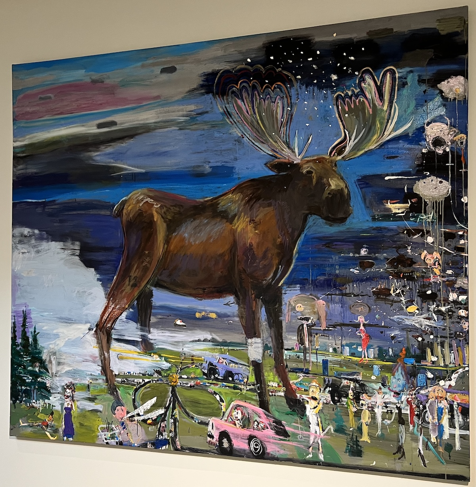

# Portland
A mid-week trip to the Portland of the East Coast. 

Andrea and I have done 2-4 day trips up to Portland a few times now, usually over school Spring Break, where we drop the child off at the Grandparents and then make the relatively short drive up to do _nothing_ but relax. There’s a lot of tasty dining options, lots of charming/cute/comfortable hotels, the entire city is walkable and exists in some sort of “not quite fancy enough to fully gentrify” state that means you can still have quirky and interesting shops and cafes with plentiful seating.

## Accommodations

We stayed at the [Longfellow Hotel](https://www.longfellowhotel.com/), which must be fairly new because it doesn’t show up on Google Street view. It was a nice hotel, the room was large and quiet, the cafe downstairs was good, we went to the spa attached and got massages. Really nothing bad to say about it. The West End has a number of similar hotels, and it’s only a mile to walk to the downtown / Old Port, unless I wanted to go island hopping or lobstering every day I think it’s the better side of town to stay in.

## Itinerary

Uh… there wasn’t one. I had a few ideas but all we really did (besides some shopping) was go to the [Portland Museum of Art](https://www.portlandmuseum.org/) which has a good size to collection ratio. Also this painting of a moose that I like, that I forgot to take a picture of the description of.
  

I did take up a side project to find the old McDonald’s Garfield glasses at each vintage store.

  
## Food

Now the important part. You could probably spend two weeks in Portland eating fantastic meals without every going to the same place twice, but we went with these restaurants:

*   [Miyake](https://www.miyakerestaurants.com/miyake). Very good. The second order of the Lobster rolls was probably unnecessary but they were tasty.
*   [Chaval](https://www.chavalmaine.com/). The small plates here were good, the larger plates / entrees were ok. Given how many good options there are for eating in Portland I don’t think we’ll be back.
*   [Fore Street](https://www.forestreet.biz/). I knew this place was highly recommended and we’ve never been able to get in on past trips, but this was probably in the top 5 meals of my life.
*   [Duckfat](https://www.duckfat.com/). We almost skipped going here, but stopped for lunch on the way out of town, thereby continuing the streak of always going here when in Portland. Good, tasty, appropriate portions.
*   [Tandem](https://www.tandemcoffee.com/). This was next to the hotel so we stopped in for breakfast, great breakfast sandwiches and a sticky bun. There was about a dozen other pastries I wanted to try but I had neither the time nor room in my stomach.
*   [Empire Chinese Kitchen](https://www.portlandempire.com/). On a past trip we stopped here for dinner and loved it. Got lunch here and it wasn’t nearly as impressive.
*   [Gorgeous Gelato](https://www.gorgeousgelato.com/). Kinda weird how many gelato places there are in Portland. Stopped here for cannolis, which were good, although entirely unnecessary.

## Notes for next time

None really. While I wanted to get out and explore a bit more, Andrea did not. And as I said the idea here is really to get away without having to travel far. Maybe I’ll take a solo trip up in the miserable months to go stand by a lighthouse and stare at the ocean like all the landscape painters of yore did.