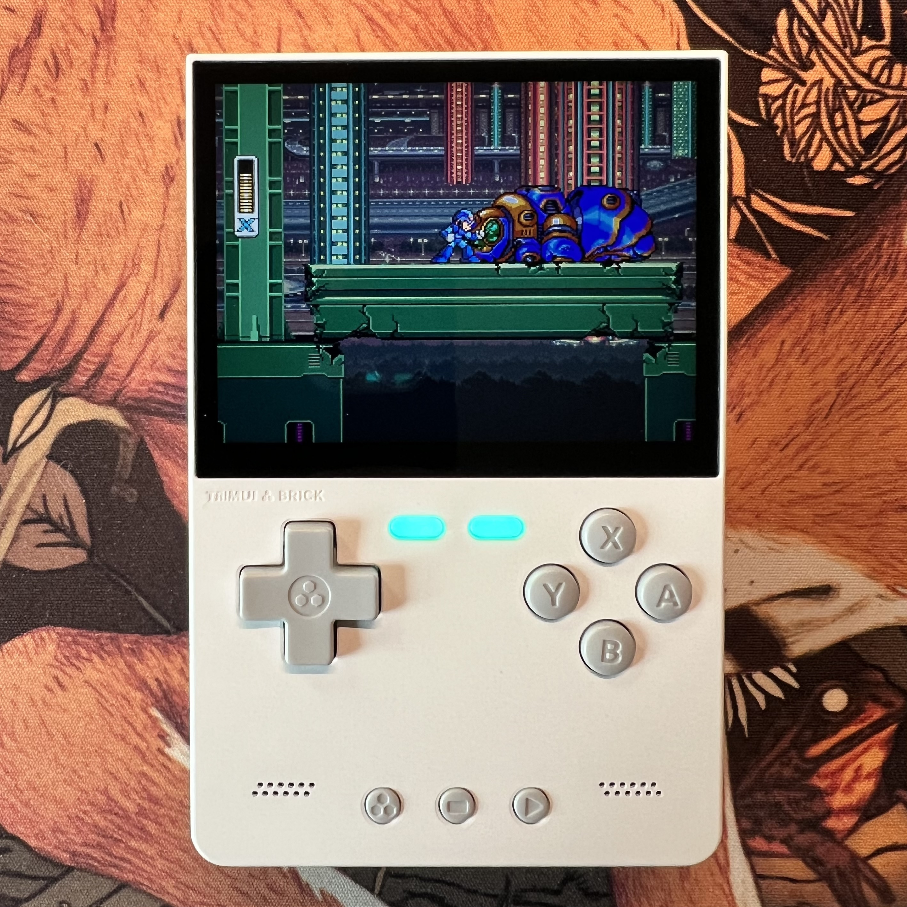

Lorelei was at a “technology and gaming camp” this week. I learned a little late that she could bring a device with her for their free time through the week. I suggested she take her iPad, which she mostly uses for Minecraft, but in a moment of personal responsibility she said she didn’t want to because she had bought it herself, and didn’t want to break or lose it.

Until recently we had a Nintendo 2DS and a Nintendo Switch in the house, but I did a big tech clean-out earlier this year and since neither were used much they went off to new homes via eBay. I have a Steam Deck but _I_ didn’t want to see that get lost of broken. I did have an original Gameboy but it’s entirely decorative at this point.

It seemed like, as someone who has been a gamer his whole life, I should have something around that was relatively portable, cheap, and easy to use to play games on. I’d kind of been aware of the retro emulator handheld market, but since I had the Steam Deck I hadn’t looked to hard at what’s out there. Turns out there’s a ton of options, and some are surprisingly nice for their price.

If you want to save yourself the deep dive into the market (because it is _deep_), here are my quick notes:

### Decide if you want joysticks.

There’s a pretty hard divide in both price and device shape between things that can emulate consoles before and after the introduction of full-direction joysticks (so, the N64 and newer, since the PlayStation released without them). I wanted something on the cheaper end so that ruled out things like the [Retroid Pocket Flip 2](https://www.goretroid.com/collections/frontpage/products/retroid-pocket-flip-2).

### Accept that the Gameboy (original, advance, and SP) were some of the greatest portable device designs in history

A few of the best Gameboy-shaped variations are:

1. The [ANBERNIC RG35XXSP](https://anbernic.com/products/rg35xxsp) which is a pretty good looking SP clone.
2. The [Retroid Pocket Classic Handheld](https://www.goretroid.com/collections/frontpage/products/retroid-pocket-classic).
3. The device I ended up getting, the [TrimUI Brick](https://trimui.net/products/trimui-brick-retro-handheld-game-64g?variant=52320864764275).

### Embrace weird Linux distros

All of these devices run on very slim versions of Linux which is fantastic, but if you’re expecting Nintendo Switch levels of UI and setup hand-holding, you’re not getting that. For the most part they’re pretty straightforward if you’re already interested in and have some understanding of how emulation works, but put some reading time aside for learning if you don’t.

### Buy direct if you can
You can find many of these devices on Amazon but what you’re actually getting is a real crap-shoot. I did it because I was trying to get one next-day, but it was a game of Amazon roulette with a bunch of random sellers with wildly varying reviews. There’s a lot of companies selling them but the ones that seemed to have the best quality to price were [Anberic](https://anbernic.com), [TrimUI](https://trimui.net), and [Retroid Pocket](https://www.goretroid.com).

## The TRIM UI Brick
As I said before what I decided on was the TRIM UI Brick. Due to the aforementioned randomness with Amazon listing I didn’t think it came with a microSD card, so I actually set one up with a variant OS called [NextUI](https://nextui.loveretro.games) before it arrived. I’m sure the stock OS is great. NextUI is too. You can customize the boot screen, the color of the LEDs, do some modifications to the emulator layouts, honestly way more than I expected for a device at this price point. And it’s well built, it feels more solid than an actual Gameboy did, and the screen is obviously 10,000x better than the ones you originally played these games on.

Lorelei has named it the Minintendo (please don’t sue us), and the other kids at camp said it was “cool”, so there you go. Personally I might grab it from time to time to try to finally beat _Zelda II: The Adventure of Link_.