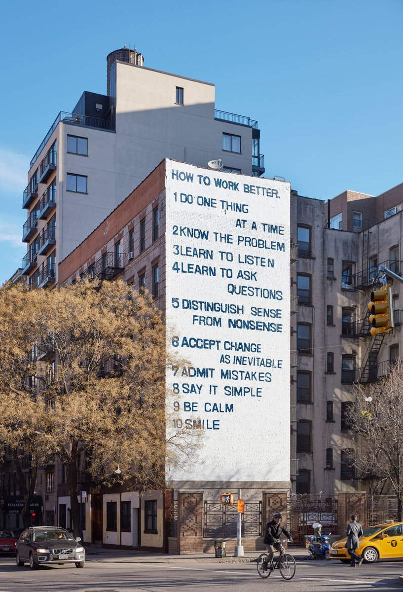

# How to work better

1.  Do One Thing at a Time
2.  Know the Problem
3.  Learn to Listen
4.  Learn to ask Questions
5.  Distinguish sense from nonsense
6.  Accept change as inevitable
7.  Admit mistakes
8.  Say it simple
9.  Be calm
10.  Smile

This was on [Houston Street in New York](https://www.guggenheim.org/articles/checklist/how-to-work-better-making-a-mural-on-houston-street).